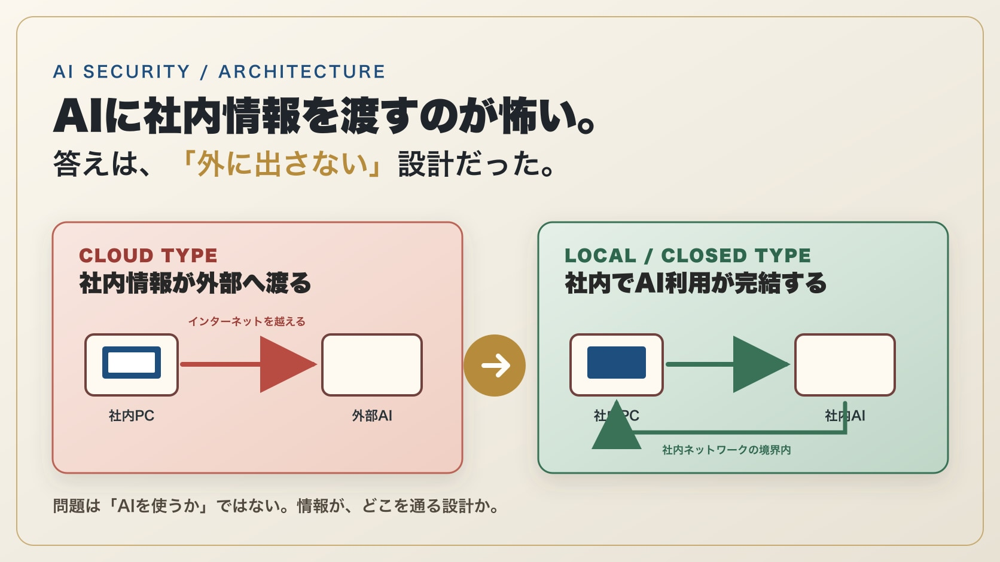
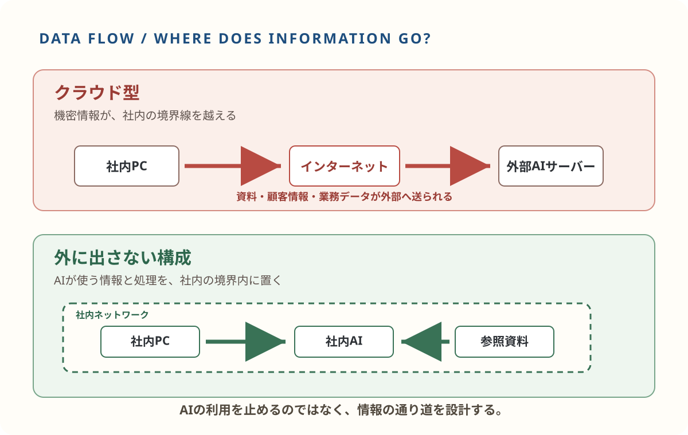
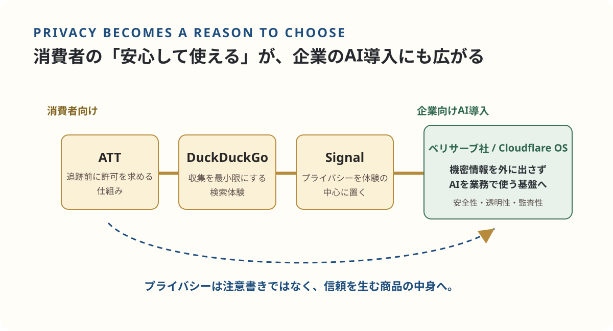
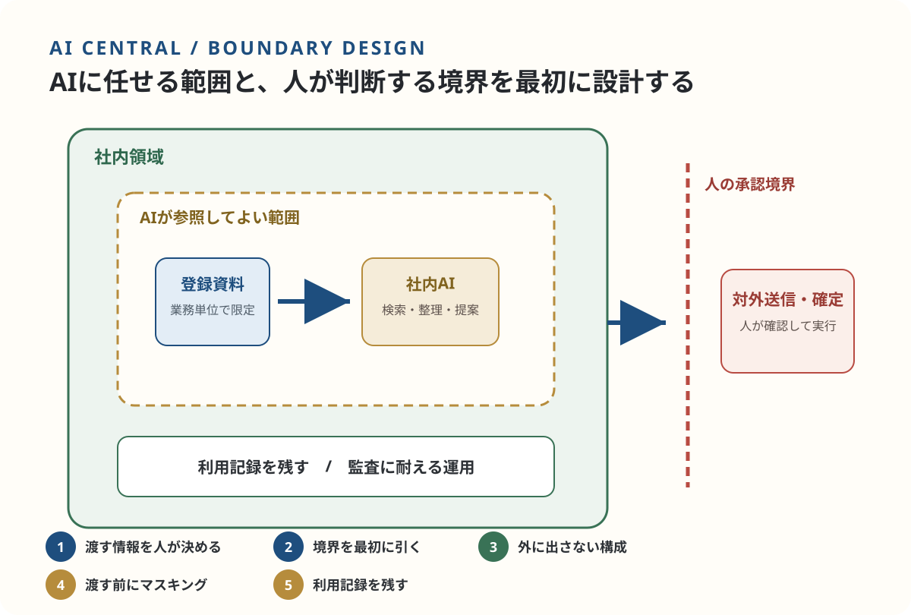
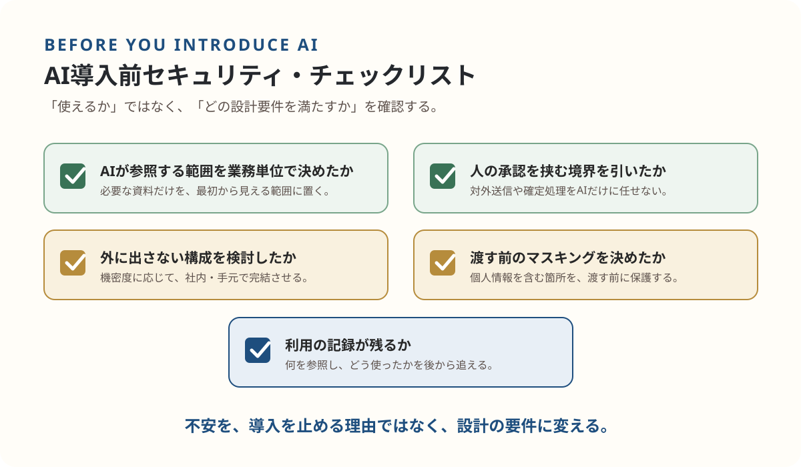

> **TL;DR**
> 社内情報をAIに使うために、AIをあきらめる必要はありません。誰が何を見られるか、どこまで社内で扱うか、人がどこで承認するかを先に決めることが出発点です。EFFECTは[AIセントラル](/ai-central/)で、その設計を会社ごとの業務に合わせて整えます。

「うちの顧客情報を、AIに入れて大丈夫なんですか」

AI導入のご相談で、必ずと言っていいほど出てくる質問です。そして、この質問に曖昧な答えしか返せないプロジェクトは、ほぼ確実に止まります。現場が使わなくなるか、情報システム部門が止めるか、経営者が判を押さないか。止まり方が違うだけで、原因は同じです。**「どこまで渡るか分からないものに、大事な情報は渡せない」**——この感覚は正しいのです。

世界はいま、この不安に「がまんして使う」でも「怖いから使わない」でもなく、**設計で答える**方向に動き始めています。今日は、その潮流が分かる記事をいくつか読み解きながら、私たちが[AIセントラル](/ai-central/)で採っている設計の考え方をお話しします。

まずは、二つの構成を大づかみに見比べてください。違いはAIを使うかどうかではなく、社内の情報がどこを通り、どこで処理されるかです。

*図1: 「使う／使わない」の二択ではなく、情報をどこで扱うかを選ぶ。*

*図2: 全体像を、実際のデータの通り道として確かめる。*

## プライバシーは「コスト」から「選ばれる理由」に変わった

Forbes JAPANに「[ChatGPTユーザー4割が離脱 プライバシーを守るイノベーションがネット利用を変革している](https://forbesjapan.com/articles/detail/101970)」と題した記事があります。タイトルは刺激的ですが、本題はその先です。記事はプライバシーを<strong>「単なるコンプライアンス要件ではなく、競争上の優位性」</strong>と位置づけ、こう論じています。

- アップル社は、アプリがユーザーを追跡する前に明確な許可を求める仕組み（ATT）を導入し、デジタル広告の経済学を根本から変えた
- DuckDuckGo社は、データ収集を最小限に抑えた検索体験で熱心なユーザー層を築いた
- 暗号化メッセージングのSignalの急速な普及は、ユーザーがプライバシーを「後付けの要素」ではなく「体験の中心」に据える企業を評価するようになったことを示している

つまり、**プライバシーはもはやユーザビリティと対立するものではなく、信頼を生み、その信頼が普及を後押しする**——これが記事の骨子です。

ここに私の見方を重ねます。この話は消費者向けサービスの話に見えて、実は**企業のAI導入の意思決定も、まったく同じ力学で動いています**。「安心して渡せる設計」を具体的に示せる会社にだけ、データと仕事が集まる。逆に、設計を示せない提案は、機能がどれだけ優れていても選ばれない。プライバシーは営業資料の末尾に書く注意書きではなく、**商品の中身そのもの**になったのです。

*図3: プライバシーを選ばれる理由にする力学は、消費者向けから企業のAI導入へも広がっている。*

## 大企業は「使わない」ではなく「外に出さずに使う」を選び始めた

その具体例が、ZDNET Japanが報じた「[ベリサーブ、機密データを外に出さない『ローカルLLM基盤』の運用を開始](https://japan.zdnet.com/article/35251149/)」です。

ソフトウェアの品質保証を手がけるベリサーブ社の顧客は、製造業・金融機関・社会インフラ事業者。扱うのは仕様書・設計書・ログ・ソースコード・ユーザー情報という、機密の塊のような情報です。情報漏えいリスクや社内規定の壁で、クラウド型の生成AIを使えないケースが少なくなかった——ここまでは、多くの会社が直面している状況と同じです。

注目すべきは、同社の答えです。**AIを諦めるのではなく、社内ネットワーク上でAIを動かす「完全クローズドなローカルLLM基盤」を構築した。** 機密データを外部のLLMに送信せずに処理し、アクセス制御と利用ログ管理を徹底し、「安全性・透明性・監査性」を重視した運用にする。つまり「使わない」という選択肢を、「外に出さずに使う」という設計に置き換えたのです。

## この構成は、もう大企業の専有物ではない

「それは大企業だからできる話でしょう」と思われるかもしれません。ここが、この1年で大きく変わった点です。

GIGAZINEが報じたとおり、Cloudflare社は[機密情報を守りながら業務アプリを作れる社内AI基盤「Cloudflare OS」をオープンソース化](https://gigazine.net/news/20260806-cloudflare-os/)しました。世界有数のインフラ企業が社内で使う「守りながら使う」仕組みが、誰でも読める形で公開される時代です。

もっと手元の話では、PC Watchの特集「[これなら社外秘情報も読ませられる！『AnythingLLM』で超快適ローカルRAG生活](https://pc.watch.impress.co.jp/docs/topic/feature/2129359.html)」が分かりやすい例です。無料のツールで、手元のパソコンの中だけで動くAIに社内資料を読ませ、**登録した資料だけを根拠に回答させる**構成が組めます。資料は外に出ず、AIが根拠のない内容をもっともらしく答えることも抑えられる。業務ごとにワークスペースを分けて、参照範囲を区切ることもできます。

道具は出揃いました。残る差は、**設計できるかどうか**だけです。

## 私たちがAIセントラルで採っている設計

*図4: AIに任せる範囲と人が判断する境界を、最初に設計する。*

私たちが提供しているAIセントラル（記憶を持つAIを社内の中枢に組み込む基盤構築）は、まさにこの潮流の側に立って設計しています。原則は5つです。

1. **渡す情報を、人が決める。** 社内の情報を全部AIに放り込むことはしません。業務単位で「AIが参照してよい範囲」を区切り、範囲の外は最初から見えない構成にします。
2. **境界を最初に引く。** AIが参照する記憶と、人が判断する境界の設計から始めます。AIは検索・整理・提案までを先に進め、対外的な送信や確定処理は人の承認を挟みます。
3. **「外に出さない」構成を選べる。** 機密度の高い情報は、手元のマシンや社内環境で完結するローカルAI構成を選択できます。ベリサーブ社の基盤と同じ思想を、中小規模の会社でも持てる形に翻訳したものです。
4. **渡す前に消す。** 個人情報を含む文書は、AIに渡す前に該当箇所をマスキング（墨消し）する前処理を挟みます。「AIの側の設定」ではなく「渡す前」に守るのが確実だからです。
5. **記録が残る。** 何を参照し、どう使ったかを追える運用にします。導入して終わりではなく、監査に耐える形で使い続けられることを重視しています。

特別な発明はひとつもありません。世界の潮流と同じ設計を、会社の規模に合わせて実装しているだけです。だからこそ、再現性があります。

*図5: 導入の可否ではなく、どの設計要件を満たすかで確認する。*

## まとめ: セキュリティは「やめる理由」ではなく「設計の要件」

冒頭の質問に戻ります。「うちの顧客情報を、AIに入れて大丈夫なんですか」——不安の正体は、**どこまで渡るか分からない**ことです。

参照範囲を決める。境界を引く。外に出さない選択肢を持つ。渡す前に消す。記録を残す。ここまで設計すれば、不安は「要件」に変わります。そしてForbes JAPANの記事が示すとおり、その設計自体が、これからは**選ばれる理由**になります。

AIの導入を検討していて、セキュリティが引っかかっている方は、「使うか・使わないか」の二択ではなく、「どういう構成なら渡せるか」から考えてみてください。その設計の相談こそ、[AIセントラル](/ai-central/)の本業です。

まずは手元で動くAIの選択肢を知ってから検討したい方は、[ローカルLLM（ローカルAI）講座（ストアカ）](https://www.street-academy.com/myclass/209048?sessiondetailid=22074182)もご覧ください。

---

### 出典

- Forbes JAPAN「ChatGPTユーザー4割が離脱 プライバシーを守るイノベーションがネット利用を変革している」 https://forbesjapan.com/articles/detail/101970
- ZDNET Japan「ベリサーブ、機密データを外に出さない『ローカルLLM基盤』の運用を開始」 https://japan.zdnet.com/article/35251149/
- GIGAZINE「Cloudflareが社内AI基盤『Cloudflare OS』をオープンソース化、機密情報を守りながら業務アプリを作成可能に」 https://gigazine.net/news/20260806-cloudflare-os/
- PC Watch「これなら社外秘情報も読ませられる！『AnythingLLM』で超快適ローカルRAG生活」 https://pc.watch.impress.co.jp/docs/topic/feature/2129359.html
