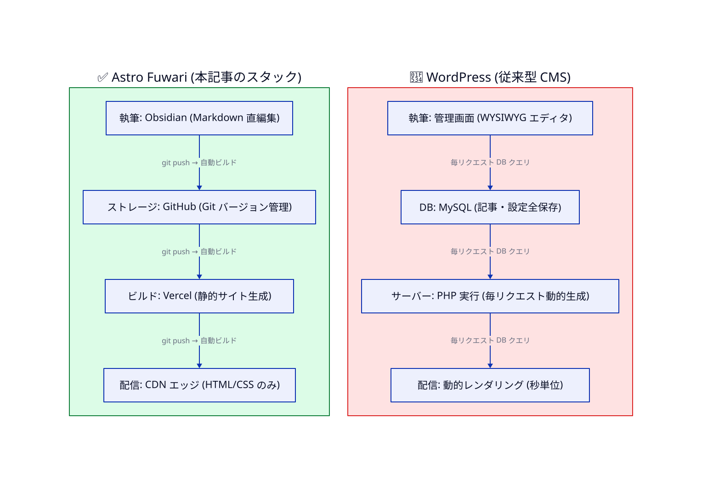

> **TL;DR**
>
> Astro Fuwari × Obsidian × Vercel × AI スキル統合の **「一気通貫ブログ運用パイプライン」**を構築した。
> 全工程 Markdown ネイティブで、AI（Claude / Higgsfield / Mermaid CLI）と相性が抜群。
> WordPress と 14 観点で比較すると、**コンテンツ駆動型サイトでは Astro が圧倒的に優位**だと分かる。
> 本記事はその実装記録と判断基準。

## なぜこの記事？

このブログ自体が、**Astro Fuwari + Obsidian + Vercel + AI 統合** で構築・運用されている。

「アイデアを書く → 記事化する → 図解を入れる → カバー画像を作る → 公開する」までを **完全に自動化** し、人間がやるのは「テーマを指示」と「OK を返す」だけ。これを 1 日で構築し終えた。

その実装記録と、長年標準であった **WordPress との比較** を整理する。Markdown ネイティブの強みは、コードで動的サイトを作るよりも「コンテンツを運用する」上で本質的に優れている。

## 一気通貫フローの全体像

構築したパイプラインの全工程はこうだ。



ポイントは「**人間が判断する箇所**」と「**AI/自動化が動く箇所**」の境目が明確であること。

| フェーズ | 担当 |
|---|---|
| アイデア・テーマ決定 | 人間 |
| 情報収集（Wiki / URL / Hermes / FORGE）| AI スキル |
| 機密フィルタ | AI スキル |
| 記事構造化・SEO 最適化 | AI スキル |
| 図解生成（Mermaid / D2）| AI スキル |
| カバー画像生成（Higgsfield Nano Banana Pro）| AI スキル |
| プレビュー確認 | 人間 |
| 公開承認（「OK」と返答）| 人間 |
| Git commit + push | AI スキル（Obsidian Git）|
| Vercel 自動ビルド・デプロイ | クラウド |
| 本番公開確認 | AI スキル |

→ 人間の関与は **テーマ指示と最終 OK** の 2 点だけ。

## 一気通貫運用の 5 つのメリット

### 1. ゼロ変換コスト（全 Markdown）

執筆（Obsidian）、ストレージ（GitHub）、ビルド入力（Astro Content Collections）、すべて **Markdown** で揃っている。

```
Obsidian (.md) → git push → GitHub (.md) → Astro ビルド → HTML
```

途中で「Notion ブロック → Markdown 変換」のような損失が無い。コードブロック・コールアウト・数式・テーブルがそのまま伝わる。

### 2. ローカル完結 + モバイル拡張可能

- **Mac の Obsidian** で執筆 → ローカル完結（クラウド依存ゼロ）
- 必要なら **Obsidian Sync（月 $10）** で iPhone/iPad と同期
- ネットがなくても下書きを進められる

「クラウド前提のサービスは便利だが障害時に何もできない」というリスクを排除しつつ、必要に応じて拡張可能。

### 3. AI 統合の自由度

Astro が「Markdown を投げ込めば HTML が出る箱」として完成しているため、**入力前の処理を AI スキルで自由に組める**。

このブログでは `astro-blog` という Claude スキルを自作し、以下を自動化した:

- **情報収集**: WebFetch / DuckDB / firecrawl
- **機密フィルタ**: クライアント名・個人情報の自動匿名化
- **記事生成**: SEO/LLMO 最適化済の構造化された本文
- **図解生成**: Mermaid（フロー）/ D2（アーキテクチャ）の自動 SVG 化
- **カバー画像**: Higgsfield Nano Banana Pro で写真風カバーを自動生成

ここに割って入れるサードパーティ AI は全部使える。**バックエンド依存ゼロ** だからベンダーロックインも無い。

### 4. 型安全な記事管理（Content Collections）

Astro v5 の Content Collections は frontmatter を **TypeScript で型検証** する。

```ts
import { defineCollection, z } from 'astro:content';

const posts = defineCollection({
  schema: z.object({
    title: z.string(),
    published: z.date(),
    tags: z.array(z.string()),
    draft: z.boolean().default(false),
  })
});
```

- 公開日を入れ忘れた → **ビルド失敗で即発見**
- tags が string じゃなく number になっていた → **本番反映前に検知**
- IDE が frontmatter を自動補完してくれる

「記事が大量に増えても破綻しない」運用基盤。

### 5. 完全静的 → 異次元の表示速度

ビルド時にすべての記事が静的 HTML に変換される。本番サーバーは「ファイルを返すだけ」。

- **Core Web Vitals**（Google が評価する表示速度）が高得点を取りやすい
- **SEO** が強い（高速性は検索順位に直接影響）
- **障害耐性**: DB も PHP も無いので落ちる要因が少ない

## WordPress との徹底比較

「ブログ = WordPress」が長年常識だった。しかし AI 時代のコンテンツ運用では、根本的に発想が異なる。



詳細を 14 観点で比較する。

### アーキテクチャ・パフォーマンス

| 観点 | Astro Fuwari | WordPress |
|---|---|---|
| サーバー要件 | 不要（静的 CDN）| PHP + MySQL 必須 |
| 動的処理 | ビルド時のみ | 毎リクエスト DB アクセス |
| 表示速度 | 数十 ms（HTML 配信のみ）| 数百 ms〜数秒（DB クエリ + PHP 実行） |
| Core Web Vitals | デフォルトで高得点 | 最適化必須・プラグイン依存 |
| スケール | CDN で無限スケール | サーバー増強必要 |

### 執筆体験

| 観点 | Astro Fuwari | WordPress |
|---|---|---|
| エディタ | Obsidian / VS Code / 任意 | 専用管理画面（Gutenberg）|
| 形式 | Markdown プレーンテキスト | DB 内に HTML 断片 |
| オフライン | ✅ 完全対応 | ⚠️ クラウド前提 |
| 並行作業 | Git ブランチで自由 | ⚠️ 衝突しやすい |
| AI 統合 | ✅ Markdown を AI で生成・編集可能 | ⚠️ 専用プラグイン必要 |

### セキュリティ

| 観点 | Astro Fuwari | WordPress |
|---|---|---|
| 脆弱性面 | 静的 HTML のみ（攻撃面が極小）| PHP + DB + プラグインの複合 |
| 管理画面ログイン | 不要（git で管理）| 必須（攻撃の主要ターゲット）|
| 定期メンテ | ほぼ不要 | プラグイン・コア・PHP の継続的更新必須 |
| 過去事故統計 | 限定的 | OWASP Top 10 級脆弱性が定期的に発見 |

### コスト

| 観点 | Astro Fuwari | WordPress |
|---|---|---|
| 月額 | **$0**（Vercel Hobby + GitHub 無料枠）| $5〜$50（共用ホスティング〜マネージド）|
| ドメイン | 別途約 $12/年（同じ）| 別途約 $12/年 |
| バックアップ | Git 履歴で自動 | 別途バックアッププラグイン |
| 拡張機能 | 大半 OSS（無料）| プラグインに有料ライセンス多数 |

### バージョン管理・移行

| 観点 | Astro Fuwari | WordPress |
|---|---|---|
| バージョン管理 | ✅ Git ネイティブ | ⚠️ DB ダンプ + 専用プラグイン |
| 過去版へ戻す | ✅ `git revert` 一発 | ⚠️ DB リストアが必要 |
| 別環境への複製 | ✅ `git clone` だけ | ⚠️ DB 移行 + URL 書換えが必要 |
| 別 CMS への移行 | ✅ Markdown はどこでも読める | ⚠️ DB スキーマ依存・ロックイン強い |

### チーム化・ワークフロー

| 観点 | Astro Fuwari | WordPress |
|---|---|---|
| 個人ブログ | ✅ 最適 | ⚠️ オーバースペック |
| 小規模チーム | ✅ Git PR ベース or ヘッドレス CMS 被せる | ✅ 標準対応 |
| 編集承認フロー | Git Pull Request | 内蔵ワークフロー |
| 役割管理 | GitHub / CMS で柔軟設定 | 内蔵ロール管理 |

### SEO・LLMO（AI 検索対応）

| 観点 | Astro Fuwari | WordPress |
|---|---|---|
| 表示速度（Google 評価）| ✅ デフォルトで強い | プラグイン頼み |
| 構造化データ（JSON-LD）| 自分で書く（柔軟）| Yoast SEO 等で対応 |
| `llms.txt`（AI 検索向け）| 簡単に追加可 | プラグイン未充実 |
| LLM が引用しやすい構造 | Markdown ベースで親和性高 | 動的 HTML で構造が複雑になりがち |

→ AI 検索（ChatGPT・Perplexity・Claude）が引用しやすいのは **構造化された Markdown** に近い HTML。Astro はここで有利。

## どんなケースで何を選ぶか

「常に Astro が正解」ではない。状況により最適解は変わる。

### ✅ Astro Fuwari が圧倒的に有利

- 個人ブログ・技術ブログ・コーポレートサイト・ドキュメント
- 月数十本までの記事更新
- 開発者・エンジニアが運用
- AI で記事生成・自動化を進めたい
- ホスティング費用を抑えたい
- 長期メンテ負荷を最小化したい

### ⚠️ WordPress の方が現実的

- 非エンジニアのチームが管理画面で運用する
- 大規模 EC・複雑なユーザー権限・会員制機能
- 既存プラグインエコシステムに強く依存している（フォーム・予約システム等）
- 既存記事資産が大量にあり移行コストが大きい

### グラデーション領域

- メディアサイト規模（月 50〜200 本投稿）→ どちらも可。チーム構成と運用者スキルで判断
- 既存 WordPress → Astro 移行 → 段階的にできる（記事を Markdown 化して Astro 側に並行運用）

## まとめ：技術選定の判断基準

WordPress も Astro も、それ自体は「正解」「間違い」ではない。

ただ、AI 時代のコンテンツ運用において Astro Fuwari の **「全工程 Markdown ネイティブ」** という性質は、根本的に優位性を持つ。

- **AI と組み合わせやすい**（Markdown は LLM の入出力に最適）
- **保守が楽**（DB なし・サーバーなし・プラグイン地獄なし）
- **コストがかからない**（静的 CDN は無料枠で十分）
- **将来移行も楽**（Markdown は標準）

「便利そう」で選ぶのではなく、**5 年後の保守負荷とロックインリスク** を直視して選ぶことが、技術選定の本質である。

## 関連リンク

- [Astro 公式](https://astro.build/)
- [Fuwari テーマ](https://github.com/saicaca/fuwari)（本ブログで採用）
- [Astro Content Collections](https://docs.astro.build/en/guides/content-collections/)
- [Obsidian Sync](https://obsidian.md/sync)
- [Vercel](https://vercel.com/)
- [WordPress](https://wordpress.org/)
