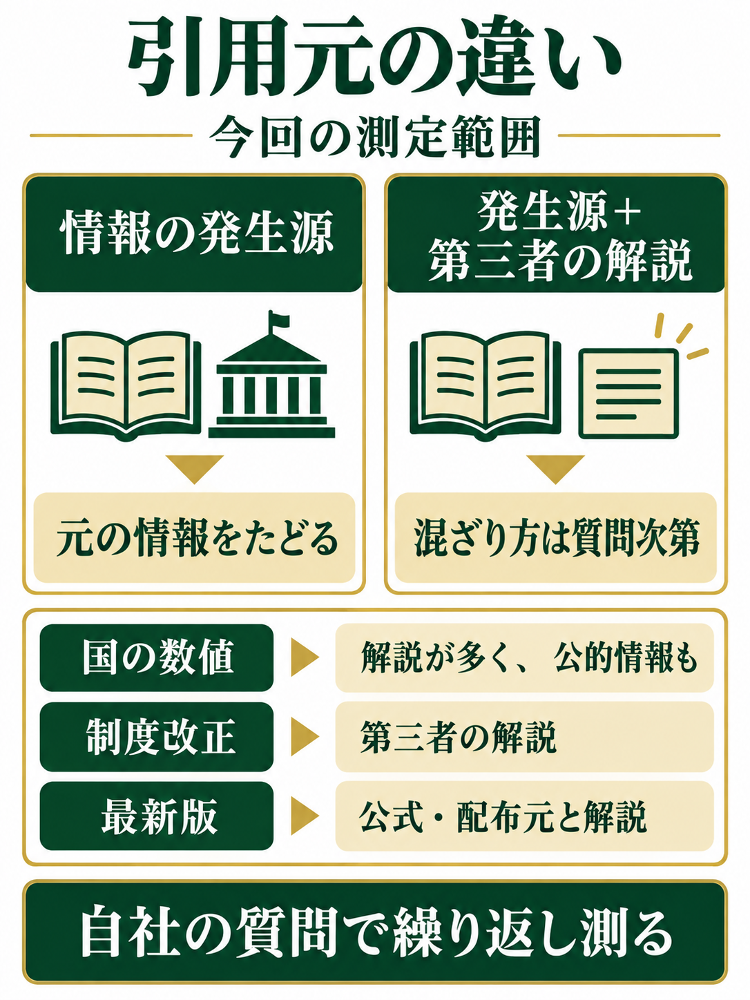

> **TL;DR**
> 同じ質問でも、ChatGPT と Gemini では引用するサイトが違いました。今回の実測では、ChatGPT は情報の発生源のみ、Gemini は発生源以外の解説記事も引用しました。<mark>AI検索対策は、「どの AI の、どの質問で載りたいか」を先に決め、自社の場合を測ることから始まります。</mark>

「その AI検索対策、どの AI に向けていますか？」。記事を増やす前に、まずここを確かめたいと思います。AIに見つけてもらいたいという目的は同じでも、回答の根拠に選ばれる場所まで同じとは限らないからです。

当社が同じ質問を ChatGPT と Gemini に投げたところ、引用元には違いがありました。答えが時間とともに変わる情報を尋ねると、ChatGPT は元の情報を出したサイトだけを引用し、Gemini はそれを解説する民間のサイトも引用していました。

これは、どちらのAIが優れているかを決める比較ではありません。自社が用意しようとしているページと、載りたい質問が合っているかを考えるための観察です。[LLMO対策の全体像](/llmo/)とあわせて、今回は実測で分かった範囲と、まだ言えないことを分けて見ていきます。

## AI検索対策で、いま Gemini を外せないのはなぜですか？

Gemini を検索に使う人が増えているためです。サイバーエージェント GEOラボの調査では、Gemini の検索利用率は **15.6%→23.2%（+7.6ポイント）**となり、サービス別で最も大きく伸びました。

この調査は、2026年8月7日〜10日に9,278人を対象として行われたインターネット調査（マクロミル）です。生成AIを検索に使う人は **52.3%**。サービス別の検索利用率は、ChatGPT **30.6%**、AI モード **28.4%**、Gemini **23.2%**でした。ChatGPT だけを見て、自社の対策全体を判断しない理由になります。

引用される場所が動いている例もあります。Ahrefs による日本の**5つの AI での集計**では、note.com が前回の5位から2位に上昇し、1位は youtube.com でした。対象は Google の AI モード、AI による概要、ChatGPT、Perplexity、Copilotです。**Gemini アプリは対象に含まれていません。**

利用率の調査と引用先の集計は、別のことを測っています。ここから「Gemini は特定の投稿先を選ぶ」とは言えません。ただ、どのAIを見て、どこへの引用を確かめるかを、固定した思い込みで決めないことが大切です。

## 同じ質問を ChatGPT と Gemini に投げて、引用元を数えました

当社の実測日は**2026年9月1日**です。同じ質問を ChatGPT と Gemini にそれぞれ**3回ずつ**投げ、回答に付いた引用元のサイトを数えました。調べたのは、サイトが巡回された回数ではなく、回答にどの情報源が付いたかです。

質問は「答えが時間とともに変わるもの」に絞りました。国が発表する保険料率や最低賃金の数値、制度改正の内容、ソフトウェアの最新バージョン、同じ内容を英語で聞いたものです。ここでは質問の種類と結果を示します。

| 測定対象 | 質問数と回答の回数 | 測定条件 |
| --- | --- | --- |
| ChatGPT | **9問×3回＝27回** | アプリの画面ではなく、開発者向けの経路から質問 |
| Gemini | **6問×3回＝18回** | Gemini 2.5 Flash。英語では測っていない |

共通する質問で引用元を見比べていますが、全体の質問数はそろっていません。また、ChatGPT はアプリの画面で表示される出典と同じとは限りません。回答の回数だけを並べて、どちらが引用されやすいかの優劣をつける比較には使えません。

同じ内容でも、国の数値を確かめたい場合と、ソフトウェアの最新版を知りたい場合とでは、情報が生まれる場所が違います。その違いも含めて、質問の種類ごとに結果を読みます。

## 今回の ChatGPT は「情報の発生源」だけを引用しました

ChatGPT は、**27回すべて、情報の発生源だけ**を引用しました。国が発表する保険料率・最低賃金の数値では、すべて国・公的機関のサイトでした。制度改正の内容では、すべて国の機関・法令データベースが引用元でした。

ソフトウェアの最新バージョンについても、公式ドキュメント・配布元・ソースの公開場所のみでした。国のサイトだから選ばれた、とまとめてしまうと、この結果を説明しきれません。ソフトウェアでは、その情報を出している公式や配布元が引用されています。

英語で聞いた場合も、同じく発生源のみでした。米国の最低賃金については、米国労働省のサイトのみが引用されました。今回の範囲では、言語を変えても、元の情報をたどる傾向が見えました。

ここで、ChatGPT が民間の情報を引用しないと一般化することはできません。測ったのは、変化する数値や最新情報を確かめる質問です。業者探しや比較は測っていません。**今回の質問では、情報を解説した場所より、情報が生まれた場所が選ばれた**という読み方にとどめます。

## Gemini は発生源以外の解説記事も引用しました

Gemini は、**6問すべてで、発生源以外のサイトも引用**しました。ただし、すべての質問で同じ混ざり方をしたわけではありません。国の数値、制度改正、ソフトウェアの版では、引用元の内訳に違いがありました。

| 質問の種類 | Gemini の引用元 |
| --- | --- |
| 国が発表する数値（保険料率・最低賃金） | 民間企業の解説記事・専門事務所などのサイトが大半。国・公的機関は一部 |
| 制度改正の内容 | 引用元はすべて民間のサイト。企業の解説記事など |
| ソフトウェアの最新バージョン | 公式に加え、制作会社のブログや Wikipedia も。1問は公式・配布元が中心で、第三者のサイトも混じった |

「発生源以外も引用した」という共通点と、「公式・配布元が中心の質問もあった」という違いを、両方残しておく必要があります。この結果から、Gemini がいつも民間の解説を優先するとは言えません。

一方で、自社が元の数値や制度を発表する立場でなくても、質問に答える解説が引用候補に入る余地は読み取れます。どの質問への解説を作るのかを決めるうえで、ChatGPT 側とは違う検討材料になります。

自社サイトが、どのAIの、どの質問で引用されているかは、他社の結果からは分からず、自社で測る必要があります。[AIクロール](/aicrawl/)の案内で、巡回の記録と、AIサイテーションによる回答の計測を確認できます。

## ChatGPT と Gemini で対策を分ける必要はありますか？

今回の実測からは、どのAIのどの質問に載りたいかに合わせて、作るページを検討する必要があると考えます。ChatGPT 向けには自社が発生源になれる情報を、Gemini 向けには質問に答える解説も候補にします。ただし、これは測定範囲からの当社の見解で、掲載を約束するものではありません。

見られているのは「権威」かどうかより、**その情報が生まれた場所かどうか**ではないか。これが当社の読み取りです。国の数値なら国の機関、ソフトウェアの版なら公式や配布元という結果は、この見方で整理できます。AIの内部の判断基準を確認したという意味ではありません。

| 載りたいAI | 今回の傾向から検討するページ | 作る前に確かめること |
| --- | --- | --- |
| ChatGPT | 自社の実測・料金・事例・判断基準など、自社が発生源になれる情報 | 他の誰かが出した情報の言い換えだけになっていないか |
| Gemini | 質問にきちんと答える解説 | 読者が知りたい内容に、ページ内で答えているか |

LLMO対策では、まず「どの AI の、どの質問で載りたいか」を決めます。ページを整える順番は、[LLMO対策は何から始めればいいですか？](/llmo/#start)にまとめています。

他の誰かが発生源の情報を言い換えるだけでは、今回の ChatGPT の傾向には合いにくいと考えられます。自社で測ったこと、自社の料金、自社の事例や判断基準なら、自社から出す意味があります。同じ情報を説明する記事をすべてやめるという話ではなく、狙う質問に対して、そのページを根拠にする理由があるかを考えます。

その際も、ページが読まれたことと、回答の根拠に選ばれたことは分けます。[AIに引用されない理由は、読まれていないからではない](/posts/not-cited-by-ai/)で扱った違いです。巡回があるだけで引用まで確認できたことにせず、回答側を測って判断します。

## この結果には、測定範囲の限界があります

今回の結果は傾向を示すもので、どの質問でも同じになるという証明ではありません。判断に使う際は、次の条件を切り離さずに読んでください。

- 回数は **ChatGPT 27回・Gemini 18回**と少なく、あらゆる質問の挙動を確かめたものではありません。
- **2026年9月1日時点**の結果です。AIの仕組みは変わります。
- Gemini は **2.5 Flash のみ**で、上位のモデルでは測っていません。
- ChatGPT は**開発者向けの経路**から質問しました。アプリの画面で表示される出典と同じとは限りません。
- AIの回答は、**同じ質問でも毎回変わります**。
- 質問は**答えが変わる情報**に絞りました。業者探し・比較・相談などの質問では、結果が違いうると考えます。

この条件を外して「自社も同じ結果になる」とは言えません。今回の比較は、自社のサイトを測る前に立てる仮説の材料です。作るページの方向を考え、その質問で実際にどう引用されるかを確かめるところまでが必要です。

## 自社サイトがどの AI に引用されているか調べるには？

対象のAIに同じ質問を繰り返し投げ、回答に付いた引用元を数えます。AIがページを読みに来た記録とは別に、回答のどこで自社の情報が引用されるかを確認する必要があります。今回の違いも、回答の引用元を数えることで見えました。

### 1回聞いて出なければ、載っていないということですか？

そうとは限りません。AIの回答は同じ質問でも毎回変わるため、1回聞いただけでは「載らない」のか「たまたま出なかった」のかを区別できません。繰り返し測った結果も、その時点と質問の範囲での傾向として扱います。

当社は、AIがどのページを読みに来ているかを日々記録する**AIクロール**と、同じ質問を繰り返し投げて回答に載るかを数える**AIサイテーション**を運用しています。AI流入の記録と、回答に載るかの計測では、確かめる対象が違います。

こうした記録と計測を続けているから、今回のような違いに気づけます。本稿は、当社が自社のサイトでの調査として、同じ考え方の測り方で回答の引用元を数えた結果です。巡回の記録は「読まれたか」を、引用元の計測は「回答に選ばれたか」を確かめるものとして区別しています。

[巡回・回答・訪問を分けて見る話](/posts/crawled-not-visited/)も、この役割の違いにつながります。自社の現状を確かめる入口として、[AIクロール / AIサイテーション](/aicrawl/)で記録と計測の内容を確認してください。

## まとめ：載りたいAIと質問を決め、自社の場合を測りましょう

今回の実測では、ChatGPT は情報の発生源だけを、Gemini は発生源以外の解説記事も引用しました。ただし、質問の種類、測定経路、モデル、時点に限りがある結果です。

<mark>AI検索対策で先に決めたいのは、どのAIの、どの質問への答えとして、自社のページを届けたいかです。</mark>自社が発生源になれる情報を出すのか、質問に答える解説を整えるのか。その方向を決めたうえで、自社サイトがどう扱われているかを測ります。

自社サイトが、どのAIに読まれ、どの質問で引用されているかを測りたい方へ。[AIクロールの料金・プラン](/aicrawl/#pricing)をご案内しています。

- **AIクロール レポート｜月額 ¥3,300**
  毎週月曜、AI由来の接点がどのページに発生しているかを実数でお届けします。続けるほど、先月と今月を比べられるようになります。
- **AIクロール + AIサイテーション ライト｜月額 ¥9,900**
  月1回の露出計測と、載らなかった場合に代わりに表示された競合ドメインを整理します。まず、自社がどの状態にいるかを確認したい方向けです。

※ AIの回答は同一の質問でも変動します。本サービスは特定の順位・掲載を保証するものではありません。

シュ コウメイ

### 出典

- [サイバーエージェント GEOラボの調査（2026年8月）](https://www.cyberagent.co.jp/news/detail/id=33787)
- [Ahrefs 日本語ブログ（AI が引用するドメインの上位10）](https://ahrefs.com/blog/ja/brand-radar-top-10-cited-domains-2026-june/)
- 当社の実測（2026年9月1日、ChatGPT 27回・Gemini 18回）
