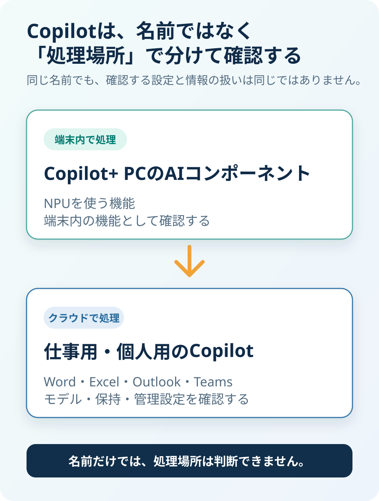
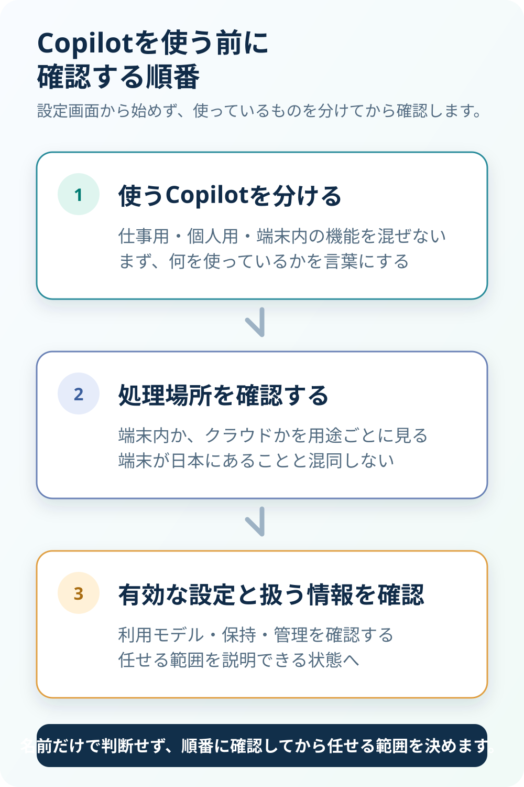

> **TL;DR**
> Copilotには、パソコンの中で処理する機能と、クラウドで処理する機能があります。仕事で使うCopilotの設定次第では、入力と出力の保持に関わるモデルを使える状態になります。まずは、自分の事務所で何を使い、どの設定が有効かを確認することから始めます。

「Copilotはパソコンの中で動くんですよね？」

顧客情報を扱う事務所の方から、こう聞かれることがあります。この問いへの答えは、半分は正しく、半分は違います。

Windowsには、端末の中で動くAI機能があります。一方で、Word、Excel、Outlook、Teamsで仕事に使うCopilotや、Windowsのタスクバーから使うCopilotアプリは、同じ「Copilot」という名前でも、処理の仕組みが別です。

大切なのは、Copilotという名前だけで安全性を判断しないことです。そのCopilotは、どのモデルで動いていますか。どこで処理され、どの設定が有効になっていますか。この記事では、用語を分けて、確認すべき順番を整理します。

## 「Copilot」は5つの別物です

Copilotはひとつの製品名に見えますが、実体と処理場所が異なるものをまとめて指しています。最初に、この違いを分けて見ます。

| 名称 | 実体 | 処理場所 |
| --- | --- | --- |
| Microsoft Copilot（仕事用・旧 Microsoft 365 Copilot） | Word、Excel、Outlook、Teams内のCopilot、Copilot Chat | クラウド |
| Copilotアプリ（Windowsタスクバー・個人用） | チャット | クラウド。オフラインではAI機能が動かない |
| Copilot+ PCのAIコンポーネント | Phi Silica、画像の生成・処理・変換 | オンデバイス（NPU） |
| Recall | 画面の記録と検索 | ローカル |
| Windows AI APIs / Windows AI Foundry | 開発者が自分のアプリに組み込む部品 | ローカル |

Microsoft 365 Copilotは、Microsoft Copilotへ改称されています。Copilot Chatも同様です。名前が整理されても、仕事用のCopilotと端末内のAIコンポーネントを同じものとして扱うと、確認すべき場所を誤ります。

「パソコンにCopilotがある」ことと、「今使っている仕事用のCopilotが端末内だけで処理される」ことは、同じ意味ではありません。

名前でひとまとめにせず、まず処理場所で分けると、次に確認する設定が見えます。

## 本当にパソコンの中で動くもの

Copilot+ PCのAIコンポーネントは、端末のNPUを使い、ローカルで実行されます。画像の生成・処理・変換については、プロンプトや画像データをクラウドへ送らずにローカルで処理すると明記されています。

Phi Silicaも、クラウドの言語モデルと異なり、言語処理を完全にデバイス上で行うものとして説明されています。つまり、オンデバイスという説明が正しいCopilotの機能は、実際にあります。

Recallも同じ側です。画面のスナップショットは暗号化してローカルディスクに保存され、Microsoftや第三者と共有しないとされています。ここだけを見れば、「Copilotはローカルで動く」という説明は間違いではありません。

ただし、この説明を仕事で使うCopilot全体へ広げることはできません。なお、Phi Silicaは**2026年9月時点**の情報として、2026年10月にWindows Insiderへ、11月にリテールへAion Instructの展開が始まり、その時点で削除される予定です。端末内で動く機能も、名前と仕様を固定したまま扱わず、確認を続ける必要があります。

## 仕事で使うCopilotはどこで処理されるのか

仕事で使うMicrosoft CopilotのLLM呼び出しは、地域内の最寄りデータセンターへ振り分けられます。ただし、混雑時には他地域へ回ることがあります。

EUの利用者はEU Data Boundary内に留まります。一方、日本はEU域外です。EU域外の顧客の処理は、米国、EU、その他の地域で行われる可能性があります。ここは、端末が日本にあることとは別に確認する必要があります。

仕事用Copilotでは、プロンプトと応答がCopilotの活動履歴として保存されます。管理者はPurviewで検索し、保持ポリシーの対象にできます。何も保存されないチャットとして扱うのではなく、組織の記録と運用の中にあるものとして考える方が実態に合います。

また、CopilotはMicrosoftが自社でホストするモデルだけでなく、OpenAIとAnthropicのモデルを副処理者として利用します。このうちAnthropicのモデルは、EU・EFTA・英国を除く商用クラウドでは、多くの顧客で既定で有効になっています。日本もここに含まれます。「うちはAnthropicを選んでいない」と思っていても、すでに使える状態になっている可能性があります。どのモデルを使える設定にしているかで、確認するべき契約上の扱いと保持の扱いも変わります。

## 設定ひとつで、預け先が変わる

Anthropicは通常、会話の中身であるプロンプトと出力を、既定では保持しません。ただし、Covered Modelsと指定された高性能モデルは、安全対策のために保持が必須です。

対象はClaude Fable 5、Claude Fable 5.1、Claude Mythos 5、Claude Mythos 5.1です。Microsoft側ではこれを「Anthropic models with Data Retention」と呼びます。Microsoft 365 管理センターで管理者が明示的に有効にした場合だけ使えるもので、既定はオフです。

有効にすると、そのモデルの利用はMicrosoftのProduct TermsとDPAの外に出て、Anthropicが独立した処理者になります。保持されるのは、要約や運用ログではありません。入力したプロンプトと、AIが生成した出力そのものです。

保持は30日で自動削除されます。ただし、自動の安全システムがフラグを立てた場合、または法的に必要な場合は例外です。フラグが立った入力と出力は、最大2年保持されます。なお、ZDR（ゼロデータ保持）を申請していても、Covered Modelsにはその取り決めが適用されません。Anthropicが個別に許可した場合を除き、これらのモデルは30日保持を前提として使うことになります。

なぜ保持が必要なのか。これは単発の入力を読むためではなく、複数のリクエストをまたいでしか見えない攻撃や、大規模な悪用を検知するためです。少しずつ言い換えた多数の亜種を送る攻撃は、ひとつのやり取りだけを見ても分かりません。安全対策には、横断して見る必要があります。

ここで必要なのは、保持の有無を善悪だけで決めることではありません。自分の事務所で、Data Retention付きのAnthropicモデルを有効にしているか、誰がその設定を変えたか、どんな情報を入力しているかを把握することです。

## ただし「読まれている」わけではない

Data Retentionがあることは、「誰かが会話を読んでいる」という意味ではありません。ここを省くと、事実と違う不安を広げてしまいます。

Microsoftは、プロンプト、応答、Graph経由のデータを基盤モデルの学習に使わないと明記しています。Anthropicも、保持データを明示的な許可なくモデル学習に使わないとしています。

既定では、Anthropicの従業員は保持された会話を読めません。人間によるレビューは、自動システムがフラグを立てた場合に限られ、承認された少数のレビュアーだけが行います。すべてのアクセスは改ざん防止ログに記録されます。

Copilotにはテナント分離と権限モデルがあり、GDPR、ISO 27001、HIPAA、ISO 42001などに準拠しています。だから「Copilotは危険だから使わない」と結論づける記事ではありません。

一方で、学習に使われないことと、どこにも処理・保存されないことも別です。何を使っているか、どの設定で使っているかを分けて確認して、初めて自分の事務所の運用に合う判断ができます。

## では、何を確認すればよいか

確認は、次の順番で進めます。いきなり設定画面を開く前に、現在使っているCopilotを言葉で分けるところから始めます。

1. **事務所で使っているのはどのCopilotかを確認する。** 仕事用のCopilotか、個人用アプリか、Copilot+ PCの機能かを分けます。
2. **Microsoft 365 管理センターの設定を確認する。** 「AI プロバイダー（Microsoftの副処理者として動作）」で、どの選択肢が有効かを見ます。
3. **Data Retention付きのAnthropicモデルが有効になっていないかを確認する。** 既定がオフでも、組織内の設定は別です。
4. **有効なら、誰が、いつ、なぜ有効にしたかを確認する。** 使う目的、入力する情報、保持の扱いを運用として説明できる状態にします。

この確認は、Copilotを止めるためのものではありません。使う道具と情報の通り道を言葉にして、顧客情報を扱う業務でどこまで任せるかを決めるためのものです。

設定だけを先に見るのではなく、この順番で確認すると、何を誰に説明する必要があるかも整理できます。

## もうひとつの選択肢

Copilotの設定を確認したうえで、扱う情報によっては、そもそも外に出さない構成を選ぶこともできます。参照範囲、人の承認、利用記録まで含めて社内のAI利用を設計する考え方は、[AIに社内情報を渡すのが怖い——答えは「外に出さない」だった](/posts/ai-security-data-stays-home/)で詳しく整理しています。

株式会社EFFECTが提供する[AIセントラル](/ai-central/)は、社内資料や顧客情報を扱うAIの参照範囲、人の承認、利用記録を業務に合わせて設計するための入口です。

「AIだから一律に止める」のではなく、どの情報を、どこで、何のために扱うのかを確かめるところから始めます。
