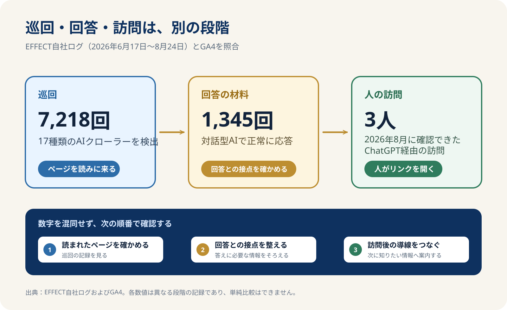

> **TL;DR**
>
> AIクローラーが来ていることと、AIの回答で紹介されること、人がサイトを訪れることは別の段階です。  
> EFFECTの自社ログでは、約69日間にAIクローラーを含む17種類のbotが7,218回来ました。GA4で確認できたChatGPT経由の人の訪問は、2026年8月の3人だけでした。  
> これは落胆する数字ではありません。<mark>巡回が始まった場所から、次に「紹介される情報」と「訪問後の導線」を整えるための記録です。</mark>

前回の[AIに社内情報を渡すのが怖い——答えは「外に出さない」だった](/posts/ai-security-data-stays-home/)では、AIへ渡す情報をどう守るかを扱いました。今回はその外側の話です。AIはサイトを読みに来ているのに、なぜ人の訪問はほとんど増えないのか。EFFECT自身の記録を、できるだけそのまま開きます。

タイトルの「3人」は推測ではありません。GA4で確認できたChatGPT経由の3セッションです。2026年8月18日に1件、19日に2件があり、いずれも別の訪問者でした。一方で、サイトを読みに来たAIクローラーは、同じ期間に何千回も確認できています。

ここで大切なのは、どちらか一方の数字だけを見て「うまくいった」「失敗した」と決めないことです。AIクローラーは、サイトの情報を見つける入口です。人の訪問は、その先にある結果です。間には、AIが情報を理解し、質問への答えとして扱い、ユーザーがリンクを開くという段階があります。

## 自社サイトに来ているAIクローラーを調べる方法はありますか？

あります。<mark>サーバー側で、クローラー名・読まれたページ・正常に応答したかを残せば、自社サイトにどのAIクローラーが来ているかを調べられます。</mark>

### 今回は、アクセスログが見えない環境に記録を足した

一般的なアクセス解析だけでは、AIクローラーがどのページを読んだかを細かく追いにくいことがあります。人の行動を見るGA4と、サーバーへ来たアクセスを見る記録は、役割が違うからです。

effect.moeでは、Cloudflare Pages Functionsでページへのアクセスを受け取り、botの識別結果とURL、応答の状態をD1へ記録する形にしました。実装のコードそのものは公開しませんが、考え方は単純です。ページを開いた相手が誰かを確認し、正常に応答できたアクセスだけを、ページ別に後から集計できるようにします。

今回は2026年6月17日から8月24日までの約69日間を集計しました。総クロール数は**7,218回**。検出したbotは**17種類**です。1日あたりに直すと約105回でした。

| bot | 自社ログで確認した回数 |
| --- | ---: |
| Bytespider | 1,895回 |
| Amazonbot | 956回 |
| Googlebot | 842回 |
| GPTBot | 744回 |
| ChatGPT-User | 618回 |
| ClaudeBot | 593回 |
| meta-externalagent | 447回 |
| OAI-SearchBot | 333回 |
| Bingbot | 254回 |
| PerplexityBot | 220回 |
| Google-Extended | 183回 |
| CCBot | 89回 |

この表は、AIに紹介された回数ではありません。サイトへ読みに来た痕跡です。検索エンジンのbotも含まれますし、AIサービスのbotにも役割の違いがあります。だから「合計が多い」だけでは、まだ判断できません。

### 対話型AIの記録は、正常な応答に分けて見る

特に、ユーザーの質問に関わりうる対話型AIのアクセスは、正常に応答したものを分けて集計しました。合計は**1,345回**です。内訳はGPTBotが583回、ClaudeBotが365回、ChatGPT-Userが173回、OAI-SearchBotが144回、PerplexityBotが72回、Claude-Userが8回でした。

どのページが読まれたかを見ると、最も多かったのは`/blog/`の一覧で683回でした。次がトップページ118回、`/author/`が65回、`/faq/`が42回です。記事本文はほとんど読まれていませんでした。

この偏りは、記事を増やせば自動的に読まれるわけではないことも示しています。入口になっている一覧、会社情報、FAQに、読み手が次のページへ進める答えがあるか。そこを整える必要があります。

AI流入の分析には、[AI CRAWL](/aicrawl/)を使います。AI別・ページ別の接点を記録し、数字を並べるだけでなく、次にどのページから見直すかを決めるためです。

## AIに読まれると、実際に人は来るのですか？

来る可能性はありますが、AIに読まれた回数が、そのまま人の訪問数になるわけではありません。今回の自社記録では、AIクローラーの総数が7,218回だったのに対し、GA4で確認できたChatGPT経由の人の訪問は3人でした。

数字の差を見て、AIに読まれる意味がないと考える必要はありません。むしろ、巡回が始まっているからこそ、次に何を確かめるかが具体的になります。

### 巡回・回答・訪問は、一本の線ではない

AIクローラーがページを取得するのは、情報を見つける段階です。そのページがAIの回答に使われるかは、次の段階です。さらに、回答に名前やリンクが出たとしても、ユーザーがクリックして訪問するかは別です。

この違いは、[ChatGPT検索でSEOは半分しか通用しない — 対策の分岐点](/posts/ai-crawl-citation-strategy/)でも扱った「読まれること」と「紹介されること」の違いにつながります。AIにサイトの存在が伝わっても、質問に対する答えとして十分か、根拠として使いやすいか、ユーザーが次の行動を選べるかは別に確認します。

たとえば、AIが`/blog/`の一覧を多く読んでいても、その一覧だけでサービスの対象者や相談できる範囲が伝わらなければ、回答で紹介される材料にはなりにくいでしょう。FAQやサービスページへの道筋が弱ければ、仮に人が来ても次の行動につながりにくくなります。

### 3人という数字は、入口を見直すための材料になる

3人という訪問は、成果の保証でも、失敗の証拠でもありません。AI経由の入口が実際に発生したことを確認できた、という記録です。ここからは、どのページに来たのか、そのページが質問に答え切れているか、相談や比較に進む導線があるかを見ます。

<mark>AIクローラーの記録は、売上を約束する数字ではなく、改善の順番を決めるための観察材料です。</mark>

これは、[LLMO対策ガイド](/llmo/)で説明している「AIにも人にも情報の意味と根拠を伝える」という考え方とも同じです。LLMOは、言葉を増やすための施策ではありません。誰が、誰へ、何を提供し、なぜ信頼できるかを、ページごとに迷わず読める状態へ近づける作業です。

## GPTBotやClaudeBotはブロックすべきですか？

一律にブロックすべきではありません。AI経由で情報を見つけてもらうことを優先するか、扱う情報や権利の保護を優先するかを、サイトごとに決める必要があります。

判断を急ぐ前に、まず自分のサイトで何が起きているかを確認します。今回のように、どのbotが、どのページを、どの頻度で読んでいるかが分かれば、「全部許可する」「全部拒否する」の二択から離れられます。

たとえば、公開情報をAIにも見つけてもらいたいサイトなら、AIクローラーを受け入れることには意味があります。一方で、公開範囲を限定したい情報や、権利上の扱いを慎重に決めるべきコンテンツもあります。大事なのは、botの名前だけで怖がったり期待したりせず、公開する情報の範囲と事業の目的を先に決めることです。

また、ブロックしないことは、AIの回答への掲載を保証するものではありません。クローラーが読みに来ること、回答で候補として扱われること、人が訪問することを分けて、必要なページを整えます。

### 次に見るべきは、数字の大きさではなく読まれ方

7,218回という数字だけを追い続けても、改善の順番は見えません。どのページが読まれているのか。そこに対象者、提供内容、料金、根拠、FAQ、次の行動が揃っているか。足りないものを一つずつ確かめる方が、次の一手につながります。

まとめると、今回の自社ログはこう読めます。AIクローラーとの接点は始まっています。しかし、巡回から人の訪問までには距離があります。だから、巡回数を喜ぶだけでも、少なさを嘆くだけでも終わらせません。<mark>読まれたページを特定し、紹介されるための情報と、訪問後に迷わない導線を整える。</mark>それが次にすることです。

AIにどう扱われているかを継続的に確認したい場合は、AI CRAWLでAI別・ページ別の接点、AI経由の訪問、改善ポイントを週次・月次で整理できます。ライトプランは、まず自社サイトにAI由来の接点があるかを見続ける入口です。
