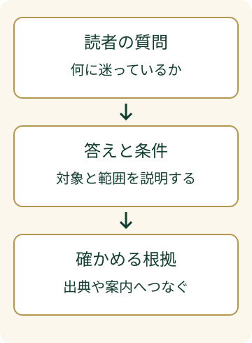

たとえば「このサービスは、初めてでも利用できますか？」という質問に、FAQで「幅広い方にご利用いただけます」とだけ答えていると、読者は自分が対象か判断できません。これは、説明のために作った架空の問い合わせ例です。

**LLMO対策のFAQ**も、まずその疑問に答えるところから始めます。LLMOは、AIの回答で情報が適切に扱われるよう、内容や伝え方を整える取り組みです。FAQは、よくある質問とその答えをまとめたものです。

> **TL;DR**
>
> FAQには、具体的な質問、最初に言い切る答え、答えが成り立つ条件、確かめられる根拠をそろえます。構造化データを足す前に、画面で読める答えを整えます。AIへの引用は保証されません。

## FAQの質問はどう選びますか？

**読者が判断に迷う場面を、一問に絞ります。** 「サービスについて」のような大きな見出しより、「初めてでも利用できますか？」のほうが、何に答えるかがはっきりします。

問い合わせの内容や公開済みの説明から、利用条件、準備するもの、対応できる範囲などを探します。問い合わせを材料にするときは、個人名や案件の内容を載せず、一般的な質問に書き直します。

一つの質問に、料金・日程・契約方法をすべて詰め込むと、答えが長くなります。別の判断が必要なものは質問を分けます。ただし、表現が少し違うだけの同じ質問を増やす必要はありません。

## 答えはどの順番で書きますか？

**答え、条件、根拠の順に書きます。** 最初の文だけでも、質問への答えが分かる形にします。

先ほどの架空例なら、サービスの実際の条件を確認したうえで、「初めての方も利用できます。事前に準備が必要な項目は、申込案内に記載しています」と書けます。初めての方が対象でないなら、無理に肯定せず、その条件を説明します。

「柔軟に対応します」だけでは、できることの境界が見えません。どこまで対応するか、何を準備するか、いつの情報かを、答えに必要な分だけ添えます。金額や件数を入れる場合は、根拠となる資料を用意し、分からない数字は書きません。

以下は、架空の文章を直す例です。自社のサービス内容に置き換えて使います。

| 曖昧な答え | 確認して書き足すこと |
| --- | --- |
| どなたでも利用できます | 利用対象と対象外の条件 |
| すぐに始められます | 開始までに必要な手続き |
| あらゆる相談に対応します | 対応範囲と専門家への相談が必要な範囲 |
| 効果が期待できます | 測る項目と、保証できないこと |

## 公開前には何を点検しますか？

**質問への答えが見つかり、条件と根拠を確かめられるかを点検します。** 文章を書いた人以外に読んでもらうと、説明を省いた箇所に気づきやすくなります。

- 最初の文は、その質問に答えているか。
- 「すぐ」「多い」「安心」などの曖昧な語に、説明が必要ではないか。
- 対象外の条件や注意点を、離れた場所に隠していないか。
- 出典や申込案内を開くと、答えの根拠を確かめられるか。
- 構造化データと画面の答えが一致しているか。

説明を更新したら、質問の答えも見直します。料金や利用条件が変わったのに、FAQだけが古いままだと、判断を誤らせます。更新日だけを変えず、答えが現在の条件と一致するか見直します。

## 構造化データを入れれば十分ですか？

**先に、画面で読める質問と答えを完成させます。** 構造化データは、ページの内容に機械向けの意味づけを添えるものです。本文にない実績や条件を書き足す場所ではありません。

[Schema.orgのFAQPage](https://schema.org/FAQPage)は、よくある質問とその答えを表す型です。一方、[GoogleのAI検索向け案内](https://developers.google.com/search/docs/appearance/ai-features)は、AI OverviewsやAI Modeへの掲載に特別な構造化データは必要ないと説明しています。これはGoogle検索の案内で、すべてのAIサービスに共通する仕様ではありません。

同じ案内は、重要な内容をテキストで示し、構造化データを画面の内容に一致させるよう説明しています。質問と答えを画像だけにせず、本文で読める形にしてください。

この説明だけでは、FAQを付けたことがAIに引用された原因だとは言えません。FAQの役割は、読者が答えを確かめやすい形を作ることです。

## 今日、どの一問から作ればよいですか？

**自社の説明で、読者が次の行動を決められない箇所を一つ選びます。** その疑問を質問にして、答えと条件を短く書き、根拠を添えてください。

たくさんのFAQを一度に作るより、実際の判断に使える一問を完成させます。公開後の問い合わせを見て、説明が足りないところを次の質問にします。

FAQは、読者の迷いを受け止める小さな説明窓口です。検索向けの形式を考える前に、「この答えで自分が対象か分かるか」を確かめましょう。

AI検索への取り組み全体を知りたい場合は、[LLMO対策の基本](/llmo/)で確認できます。
