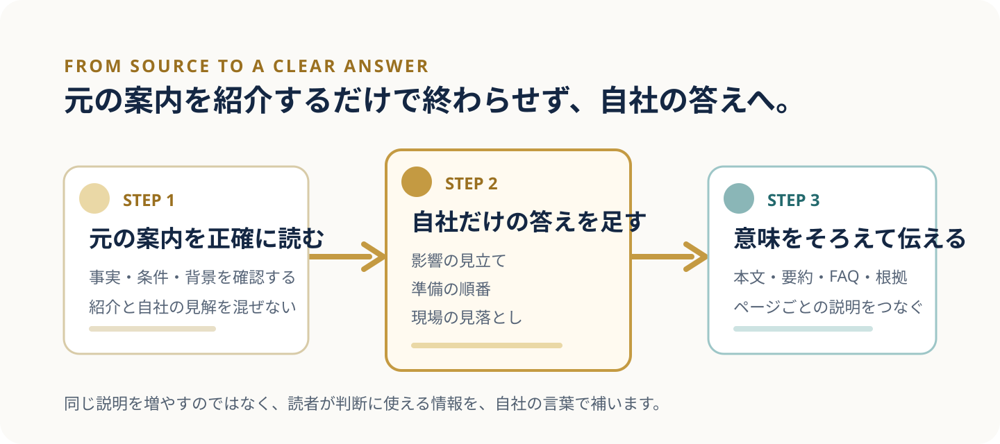

> **TL;DR**
> AIに読まれたとしても、AIの回答に引用されるとは限りません。同じ説明が元の案内にあるなら、その案内が優先して紹介されることがあります。<mark>AI検索対策では、自社にしか書けない実務の答えを足し、その意味を人にもAIにも伝わる形に整えることが大切です。</mark>

「ページは読まれているのに、なぜ質問への答えとしては出てこないのだろう」。AI検索対策を考え始めると、この疑問に行き着くことがあります。けれど、ここで記事の質や書き手の力だけを疑う必要はありません。読まれることと、回答の根拠として選ばれることには、間にいくつかの判断材料があります。

[前編で扱った巡回と訪問の差](/posts/crawled-not-visited/)では、AIクローラーの巡回7,218回に対してAI経由の人の訪問3人という自社記録を示しました。そこで確かめたのは、情報を見つける入口と、人が訪れる結果は同じではないということです。今回はさらに一歩進めて、AIの回答に名前やURLが使われる場面を考えます。

たとえば、ある制度や出来事の要点を説明する記事を考えてみてください。内容が正しく読みやすくても、公式の発表ページや原典に同じ説明があるなら、AIはそちらを参照元として案内することがあります。これは自社の記事が劣っているという話ではありません。元の情報を出したページと、そこから意味を広げるページでは、担う役割が違うからです。

## 自社サイトが ChatGPT に引用されているか調べるにはどうすればよいですか？

まず、ページが取得された記録と、AIの回答に自社名・サービス名・URLが現れる記録を分けて見ます。AIクローラーが来ていれば、AIが情報を見つける入口はあります。ただし、その事実だけでは、どの質問で何が根拠として使われたかまでは分かりません。

ここでいうllmo対策とは、AIが答えを組み立てるときに、誰が何を提供していて、どの説明に根拠があるかを読み違えにくく整えることです。[LLMO対策の考え方](/llmo/)では、検索順位だけでなく、ページごとの役割と情報のつながりを整える必要性を説明しています。

確かめる際は、質問を変えながら、自社名だけでなくサービス内容、比較される条件、利用前に迷いやすい点まで見ます。名前が出たかどうかだけを追うと、実際には別のサイトが根拠になっている場面や、URLは出ていても質問の核心に答えられていない場面を見落としやすいためです。

## AIに引用されない記事には、どんな共通点がありますか？

よくあるのは、説明が元の案内の要約で終わっている状態です。要約には価値がありますが、質問に対して「この会社ならどう判断するのか」まで答えられなければ、AIはより直接的な情報源を選ぶと考えられます。AIに引用されないことは、内容が悪いという判定ではなく、答えの役割がまだ重なっているというサインになりえます。

もう一つは、記事内に必要な情報があっても、意味のまとまりが分かれている状態です。サービスページには提供内容、別のページには根拠、FAQには条件があるのに、互いの説明がつながっていない。人が全ページを順番に読めば理解できても、回答づくりで一部だけが参照されると、必要な前提が欠ける状況が起こりえます。

逆に、元の案内の紹介に、自社の経験からしか書けない整理を重ねた記事は役割を持ちやすくなります。大切なのは、無理に新しい言葉を増やすことではありません。読者が次の判断に使える具体性を、参照元の説明と混同しない形で置くことです。

| 元の案内が担うこと | 自社の記事に足せること |
| --- | --- |
| 事実・制度・発表の要点 | 自社の規模なら何が影響するかの見立て |
| 共通の手順や条件 | 準備を始める順番と期限の考え方 |
| 一般的な注意点 | 現場で見落としやすい確認事項 |

## AIに引用されるようにするには、記事に何を足せばよいですか？

足すべきなのは、答えを長くするための言葉ではなく、読者が自社に置き換えて判断できる材料です。たとえば、影響の範囲をどう見積もるか、着手前に誰と何を確認するか、途中で止まりやすい箇所はどこか。こうした情報は、公式の説明を読んだだけでは埋まりにくい部分です。

書く順番も重要です。まず結論を短く置き、次にその判断が必要になる状況、根拠、具体例、次の行動を並べます。専門用語を使うなら、初めて出す場所で意味を説明します。これなら、急いで答えを知りたい人も、背景を確かめたい人も読み進めやすくなります。

さらに、本文だけを直して終わりにはしません。見出し、冒頭の要約、FAQ、運営者やサービスの説明にも同じ前提が伝わるよう整えます。<mark>ページごとの説明が矛盾なくつながるほど、読み手もAIも「このページは何に答えるのか」をたどりやすくなります。</mark>これはAIが必ず引用するという約束ではありませんが、必要な情報を取り違えにくくするための土台になります。

つまり、AI検索対策は「AIに選ばれる魔法」を探すことではありません。誰の問いに、どの情報を使って、どこまで答えるかをはっきりさせることです。元の案内を丁寧に扱いながら、その先の判断を助ける答えを自社の言葉で重ねていきます。

## まとめ：AI検索対策は、元の案内の先にある判断材料を整えることから始まります

AIに引用されない記事は、読まれていない記事とは限りません。情報を見つけること、内容を理解すること、質問への答えとして使うことは、別々に起こりえます。だからこそ、元の案内と同じ説明で終わらせず、自社ならではの影響の見立て、準備の順番、現場の確認点を加えます。

AI流入の分析には、[AIクロール](/aicrawl/)を使います。どのページに接点があるかを確かめながら、次に直す場所と順番を見つけるためのサービスです。数字だけを眺めず、質問に答えられるページになっているかまで一緒に見直していきます。
