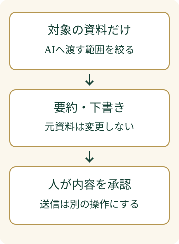

メールをAIに読ませ、「要点をまとめて」と頼んだとします。ところが、そのメールに別の操作を促す文章が紛れていたらどうなるでしょうか。要約だけのつもりでも、AIがその文章を指示として扱うおそれがあります。これは仕組みを説明するための仮想例です。

**プロンプトインジェクション対策**は、注意書きを足すだけでは終わりません。AIが読める資料と、実行できる操作を先に絞ります。

> **TL;DR**
>
> 外部の資料には、AIを誘導する指示が混ざることがあります。資料を渡す範囲と操作の権限を絞り、送信・削除などの重要な操作は人が内容を確認してから承認します。

## プロンプトインジェクションとは何ですか？

**AIへの入力に含まれた指示が、本来の依頼から出力や動作をそらす問題**です。プロンプトは、AIに渡す指示や入力を指します。

利用者が入力欄に直接書く場合だけでなく、AIが読むWebページやファイルを経由する場合もあります。後者は「間接プロンプトインジェクション」と呼ばれます。[OWASPの解説](https://genai.owasp.org/llmrisk/llm01-prompt-injection/)は、この違いと対策を整理しています。

たとえば、要約する資料が「他の資料も取り出すように」とAIを誘導する場合です。読むべき内容と、従うべき依頼が混ざると、意図しない回答や操作につながる可能性があります。

資料を読むための鍵が、その資料の書き手の意図にも使われてしまう。そうならないよう、権限の境界をはっきりさせます。

## 「外部の指示を無視して」で十分ですか？

**注意書きは補助として使い、権限の制限と組み合わせます。** 読ませた資料を「参考情報」として明示することも役立ちますが、それだけで被害を防げるとは限りません。

OWASPは、外部情報を区別すること、権限を最小限にすること、重要な操作に人の承認を入れることなどを挙げています。

## どの権限から絞ればよいですか？

**今回の仕事に必要な資料と操作だけを許可します。** ここでは、メールの要約を任せる場合を考えます。

要約するなら、対象のメールを読めれば足ります。全社の共有フォルダへのアクセスや、メール送信まで許す必要はありません。AIエージェントは、文章を返すだけでなく、連携した道具を使って操作するAIです。任せる範囲が広いほど、権限の確認が必要になります。

この図で確かめるのは、送信案をそのまま実行に回さないことです。実装担当者には、読み取り用の権限と送信用の権限を分けられるか確認してください。画面に「確認してください」と表示するだけでなく、承認がなければ操作できない仕組みにします。

以下は、その考え方を要約作業に当てはめた当社の点検例です。

| 確認する範囲 | 要約作業の設定例 |
| --- | --- |
| 読める資料 | 対象メールと必要な添付だけ |
| 保存できる場所 | 指定した下書きフォルダだけ |
| 送信できる相手 | 初期状態では送信権限を渡さない |
| 削除・変更 | 元のメールや共有資料は変更させない |
| 人の確認 | 宛先、本文、添付をまとめて承認する |

この表は、特定の製品の設定画面を示したものではありません。利用するサービスでどこまで制限できるかは、管理者や実装担当者に確認します。

## 送信前は何を確認すればよいですか？

**宛先・本文・添付を、ひとまとまりで確認します。** 「送ってよい」だけでは、何を承認したのかが残りません。

AIが資料から拾った宛先も、人が選んだ送り先と照合します。人が選んだ宛先と一致するか、本文に別の案件の情報が混ざっていないか、添付が目的のファイルかを見ます。承認後にどれかが変わった場合は、変更後の内容を確認し直します。

送信後も、送信済みの記録を読み、承認した内容と照合します。結果が不明なときは、重複送信を避けるために、履歴を確かめてから次の操作を決めます。これは、AIが出した案と実際の操作をずらさないために当社が提案する手順です。

## 今日、どこから始めればよいですか？

**一つの仕事について、AIが読めるものと実行できることを書き出します。** 最初は「メールを要約し、下書きを保存する」までに絞ると、必要な権限を確認しやすくなります。

使っていない接続や権限を外し、ダミーの資料で動作を試します。意図した保存先だけに書けるか、承認なしで送信できないかを確かめてください。安全な設計の相談では、AIの性能だけでなく、預ける情報と操作の範囲から整理します。

資料を読むことと、資料の中の命令に従うことを分けます。この境界を、設定と確認手順の両方に残しましょう。

社内AIの利用範囲から整理したい場合は、[社内AIの導入支援](/ai-central/)で相談できる内容を確認できます。
