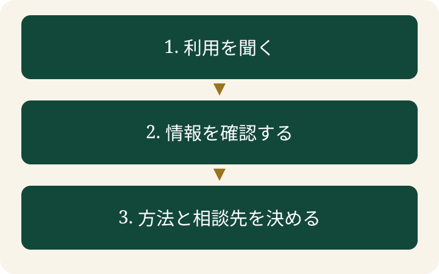

「会議メモの要約、何で作ったの？」と聞くと、「個人アカウントのAIです」という返答がありました。便利な要約の裏で、誰が何をどこへ送ったのか、会社では把握できていません。これは説明のための架空の例です。

**シャドーAI対策は、利用の棚卸しから始めます。** 道具の名前だけでなく、アカウント、入力する情報、保存先、外部サービスとの接続まで確かめます。ここでは、小さなチームでも始められる確認表と進め方を紹介します。

> **TL;DR**
>
> 利用している道具・アカウント・入力情報を聞き、確認できていない項目を記録します。そのうえで、使える道具と情報の範囲、困ったときの相談先を決めます。

## シャドーAIとは何ですか？

**会社のIT・セキュリティ担当が把握、承認、管理できていないAI利用です。** Microsoftも、このような組織の管理外の利用をシャドーAIと説明しています。[Microsoftの説明](https://learn.microsoft.com/en-us/purview/deploymentmodels/depmod-data-leak-shadow-ai-intro)

「有料のAIだから安心」「仕事に役立つから問題ない」という判断だけでは、会社が利用を認めた範囲は分かりません。同じサービスでも、個人契約と会社契約では、管理できる項目や設定が異なる場合があります。名前だけで許可を判断せず、実際の契約と設定を確認します。

EFFECTでは、道具を使いたい理由も一緒に聞く進め方を勧めます。先ほどの架空例なら、必要なのは会議メモの要約です。利用状況を確認すると同時に、その仕事を続けられる方法を探します。

## 棚卸しでは何を聞けばよいですか？

**「何の仕事に、どの道具で、何を入れたか」を一行にします。** 最初から入力した原文を集める必要はありません。調査のために、機密情報を別の場所へ複製しないようにします。

| 確認する項目 | 聞き方の例 | 記録する内容 |
|---|---|---|
| 用途・道具 | どの仕事を、何で行っていますか？ | 要約、文章案などの用途とサービス名 |
| アカウント | 会社の契約ですか、個人の契約ですか？ | 契約の区分と管理担当 |
| 入力情報 | 公開情報ですか、社内の資料ですか？ | 情報の種類。原文や個人名は不要 |
| 保存・共有 | 履歴や添付は、どこに残りますか？ | 確認した設定と未確認の項目 |
| 外部接続 | ファイルやメールを連携していますか？ | 接続先、読める範囲、確認する担当 |

分からない欄は「未確認」と書きます。推測で「保存されない」「学習に使われない」と記入すると、後から確認する項目が分からなくなります。契約、公式の説明、管理画面の設定を確認してから更新します。

## 入力してよい情報はどう分けますか？

**情報の公開範囲と、利用条件を分けて確認します。** 次の分類は運用を考えるための例です。自社の契約や規程に合わせて決めます。

- 公開済みの情報：公開した資料を使う場合も、転載や利用の条件を確認します。
- 社内の情報：社内限定の手順や会議メモは、利用を認めた環境と条件を確認します。
- 個人情報・取引先の秘密：担当者が、その情報を扱える環境と手順を確認するまで入力を止めます。

名前だけを消しても、部署、日程、出来事の組み合わせから個人や取引先が特定されることがあります。「匿名にしたから使える」と一律に決めず、必要な内容を一般化できるかを見ます。実際の資料を使わなくても、架空の文章で手順を試せる仕事はあります。

## 見つかった利用はどう扱いますか？

**確認できていない入力を止め、代わりの進め方を決めます。** 許可したサービスでも、すべての情報を入力してよいとは限りません。道具と情報を組み合わせて判断します。

架空の会議メモの例なら、まずそのメモの扱いと利用環境を担当者に確認します。その間は、架空の文章で要約の手順を試す、機密部分を含まない公開資料だけで作業する、といった選択肢を検討します。代替案も自社のルールに沿って選びます。

外部ファイルを読む連携がある場合は、連携先と読める範囲も確認します。入力欄に貼り付けた文章だけを調べても、接続から取り込まれる情報は把握できません。漏えいが疑われる場合は、独断で履歴を削除せず、社内の事故対応手順に従って担当者へ連絡します。

## 棚卸しを続けるには何を残しますか？

**用途ごとに、許可した方法と未確認の項目を残します。** 道具の一覧だけでは、次に同じ仕事をする人が判断できません。

記録には「用途」「使える道具とアカウント」「入力できる情報の範囲」「確認日」「確認した担当」「相談先」を含めます。道具や契約、接続先を変えたときは、以前の確認結果がそのまま使えるかを見直します。

相談するときに必要な情報も決めておくと、担当者が判断しやすくなります。「要約に使いたい」「個人アカウントを使っている」「社内資料を入れる予定」のように、用途と環境を伝えられる形にします。秘密の原文を相談用のチャットへ貼る必要はありません。

## よくある質問

### 社員への聞き取りだけで、すべて見つかりますか？

聞き取りだけで把握できるとは限りません。会社の契約一覧や、確認できる範囲の利用記録も照合します。調査済みの範囲と、未確認の範囲を記録します。

### 会社が認めたAIなら、何を入れてもよいですか？

いいえ。入力する情報、契約、設定、外部接続の条件を確認します。サービスの承認と、特定の情報の入力許可は分けて判断します。

### 棚卸し表に、入力した文章を保存しますか？

この表では、情報の種類と確認結果を記録します。入力の原文が必要な事故調査などは、担当者の手順と保管場所に従います。

関連する内容は、[AI時代のセキュリティの基本](/ai-security/)、[AIに渡す情報の範囲を考える](/posts/ai-security-data-stays-home/)でも説明しています。
