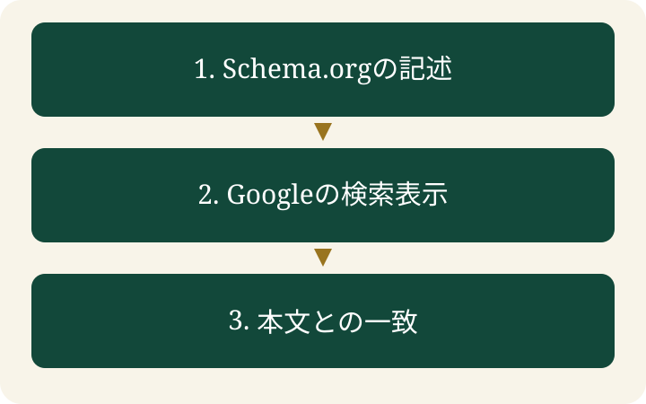

構造化データの検査でエラーが見つからなかったのに、別の検査では期待した項目が出てこない。「実装を間違えたのか」と迷ったら、最初に見たいのは検査ツールの名前です。これは、違いを説明するための架空の場面です。

**構造化データのチェックでは、記述・Googleの検索表示・本文との一致を分けて確認します。** 一つの検査結果から、すべて正しいとは判断できません。どこまで確かめたかを記録すれば、次に調べる場所が決まります。

> **TL;DR**
>
> Schema.orgの記述はSchema Markup Validatorで、GoogleのリッチリザルトはRich Results Testで調べます。画面に表示する内容との一致は別に確認します。エラーがなくても、検索表示やAIへの引用は保証されません。

## 二つの検査ツールは何が違いますか？

**対象が違います。** 構造化データは、ページの情報を決まった形式で記述するものです。Schema.orgは、その記述に使う共通の語彙です。

Googleは、Schema.org全般の検証にSchema Markup Validatorを、Googleのリッチリザルトの確認にRich Results Testを案内しています。[Googleの検査ツール案内](https://developers.google.com/search/docs/appearance/structured-data)

| 確認したいこと | 使うもの | 結果から言える範囲 |
|---|---|---|
| Schema.orgの記述を抽出し、構文を確認したい | Schema Markup Validator | 抽出された種類や情報、検出された記述上の問題 |
| Googleのリッチリザルトの対象を確認したい | Rich Results Test | 対象となる検索表示に関する検査結果 |
| 本文と記述の内容が合っているか確認したい | ページ画面と実装内容の照合 | 照合した情報の一致と、不一致の箇所 |

リッチリザルトは、通常の検索結果に加わる特別な表示です。Schema.orgで定義された種類のすべてが、Googleのリッチリザルトに対応するわけではありません。「見つからない」という結果を読む前に、どの種類をどの目的で記述したのかを確認します。

## どの順番でチェックしますか？

**記述を確認し、目的に応じたGoogleの検査を行い、本文と照合します。** 検査は、修正したファイルだけで終わらせず、実際に公開するページの状態でも行います。



1. Schema Markup Validatorで、意図した種類と情報が抽出されるかを確認します。
2. Googleの特定の検索表示を狙う場合は、その種類の公式ドキュメントを読み、Rich Results Testの結果を確認します。
3. ページを開き、名称、説明、日付などを、構造化データに記述した値と照合します。
4. 公開後は、公開URLで検査をやり直します。下書きのコードを検査した結果とは分けて残します。

Schema Markup Validatorは、URLまたは直接入力した記述から、構文上の間違いを検出できます。[Schema.orgの説明](https://schema.org/docs/validator.html)

開発中のコードを検査できても、公開ページに同じコードが出ているとは限りません。テンプレートやプラグインが別の記述を追加していないかも、出力されたページで確認します。

## エラーや警告はどう読みますか？

**種類、項目、指摘された理由を一組で読みます。** たとえば、JSONの区切りのカンマが欠けているなら記述を直します。項目の不足が指摘されたら、対象の公式ドキュメントで必須か推奨かを確認します。これは読み方を示す架空例で、実際の検査画面の再現ではありません。 エラーの件数だけを報告すると、何を直す必要があるのかが伝わりません。

たとえば、架空のサービス紹介ページで、表示するサービス名と記述した名称が違っていたとします。構文が正しくても、読者が見る内容とは合っていません。この場合は、ページの正しい情報を確認してから、本文と記述をそろえます。

警告は、対象の種類や項目の説明を読んで判断します。必須項目なのか推奨項目なのか、自分のページに該当するかを確かめます。検査を通すために、実在しない評価や金額を足してはいけません。

情報が不足している場合は、まず本文で読者に伝える内容を整えます。記述する値だけを増やしても、画面に根拠のない情報が残れば確認は終わりません。

## エラーがなければ、検索結果に出ますか？

**表示は保証されません。** Googleは、正しく記述してもリッチリザルトへの掲載を保証しないと説明しています。技術的な検査で確かめられない品質に関する条件もあります。[Googleの構造化データに関する方針](https://developers.google.com/search/docs/appearance/structured-data/sd-policies)

LLMOでも、検査の合格をAIへの引用の証明にはできません。GoogleのAI OverviewsやAI Modeのために、特別な構造化データを追加する必要はありません。Googleは、構造化データを画面に表示するテキストと一致させるよう案内しています。[GoogleのAI機能に関する説明](https://developers.google.com/search/docs/appearance/ai-features)

この説明はGoogleのAI機能についてのものです。他社のAIサービスまで同じ仕様だと広げて解釈しません。引用を調べる場合は、サービス名、質問、確認日、実際の回答を別に記録します。

## 確認結果はどう残しますか？

**「何を検査したか」と「まだ何が分からないか」を残します。** EFFECTでは、確認の範囲が後から分かる記録を勧めます。

次の書式は検査記録の例です。実際の結果を記入して使います。

```text
対象：公開URL／下書きのコードのどちらか
確認日：実際に検査した日
道具：利用した検査ツール
種類：抽出された種類、確認した項目
結果：問題の内容と、修正後の再検査結果
本文との照合：確認した値、不一致の有無
未確認：検索表示、AIへの引用など、今回調べていないもの
```

「構造化データを確認済み」だけでは、公開URLを調べたのか、下書きの構文だけを調べたのかが分かりません。結果と範囲を一緒に残せば、更新時に同じ条件で検査できます。

## よくある質問

### Schema Markup Validatorだけで十分ですか？

目的によります。Googleのリッチリザルトを確認したい場合は、対象の公式ドキュメントとRich Results Testも使います。本文との一致は別に確認します。

### エラーゼロなら、AIに引用されますか？

保証されません。記述の検査と、実際の回答で引用されたかの確認は分けます。

### 公開前の検査だけで終えてよいですか？

公開後にも、公開URLで確認します。下書きと公開ページの出力が同じとは限らないためです。

関連する内容は、[LLMO対策の基本](/llmo/)、[AIに引用されない理由を考える](/posts/not-cited-by-ai/)でも説明しています。
