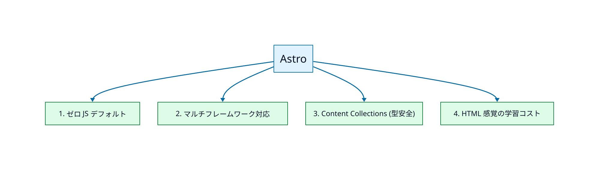
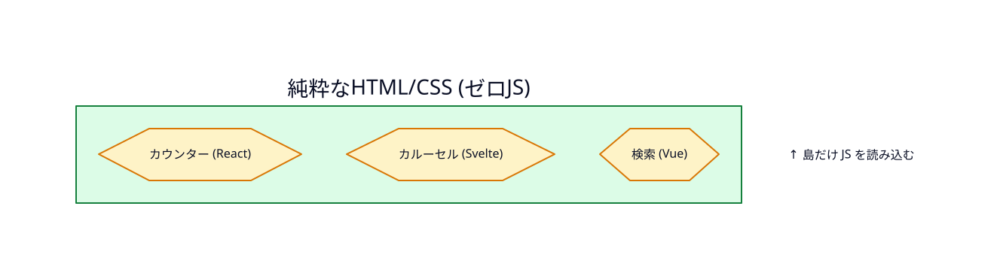

> **TL;DR**
>
> Astro は「コンテンツ駆動型サイトの本命」と評されるほど支持を集めている。
> その理由は、**①デフォルト ゼロ JS の爆速表示**、**②マルチフレームワーク対応**、**③Content Collections による型安全な記事管理**、**④HTML 感覚で書ける低い学習コスト**、の4点に集約される。

## なぜこの記事？

「ブログやコーポレートサイトを作るなら何で作るのが正解？」と聞かれた時、最近の答えは迷いなく **Astro（アストロ）** になっている。Next.js や Nuxt のような強力なフルスタックフレームワークがある中で、なぜ Astro なのか。

本記事では、コンテンツ駆動型サイト（ブログ・メディア・ドキュメント・コーポレートサイト）を構築する立場から、Astro が圧倒的に優れている **4つの理由** を、具体的な仕組みと一緒に解説する。

実は、このブログ自体も Astro（Fuwari テーマ）で構築している。実装の手触りも踏まえて書いていく。



## Astro が圧倒的に優れている4つの理由

### 1. 「デフォルトでゼロ JS」が生む、爆速の表示スピード

従来の React や Vue ベースのフレームワークは、ページ全体を動かすために大量の JavaScript をブラウザにダウンロードさせる必要があり、これが読み込み速度の低下につながっていた。

Astro はここで真逆の発想を取る。**ビルド時にすべての JS を剥ぎ取り、純粋な HTML と CSS だけを出力する**のがデフォルト挙動だ。

その結果：

- ページの **初期読み込みが圧倒的に速い**
- **Core Web Vitals**（Google が評価する表示速度指標）のスコアが高くなる
- **SEO** が強くなる
- モバイル回線でも快適に閲覧できる

#### 💡 アイランドアーキテクチャ（Islands Architecture）

「じゃあ、開閉メニューやカルーセル（画像スライダー）みたいな動的なパーツはどうするの？」と当然疑問になる。

Astro の答えは、**動的なパーツだけを「アイランド（島）」として定義し、その部分だけピンポイントで JavaScript を読み込ませる**、というアプローチ。



```astro
---
import Counter from '../components/Counter.jsx';
---

<h1>静的なコンテンツはゼロ JS で配信</h1>
<p>このテキストは HTML だけで届きます。</p>

<!-- ↓ この島だけ JS を読み込む -->
<Counter client:visible />
```

`client:visible` のようなディレクティブを書くだけで、その部品だけ画面に入ったタイミングで JS を読み込んでくれる。「動かしたい部分だけ動かす」という設計思想が、爆速サイトを実現する正体だ。

### 2. React、Vue、Svelte を「混ぜて」使える自由度

Astro 最大のユニークな強みが **マルチフレームワーク対応** だ。

「このボタンは React で書きたいけど、あっちのフォームは Vue で書きたい」といったことが、**同じプロジェクト、さらには同じページ内で簡単に実現できる**。

これが生み出す価値：

- **過去に作った React のコンポーネント資産をそのまま使い回せる**
- チームに React 派と Vue 派がいても、それぞれの得意な言語で開発できる
- 「あの新しい Svelte コンポーネントだけ試したい」みたいな部分的採用ができる
- **フレームワークの流行り廃りにサイト全体が振り回されない**

技術選定の自由度を確保しながら、レガシー資産も活かせる、という設計はかなり実務的。

### 3. コンテンツ管理が劇的に楽（Content Collections）

Astro は **Markdown（.md）や MDX（Markdown 内でコンポーネントが使えるファイル）の扱いが標準でめちゃくちゃ強力** だ。

特に **「Content Collections（コンテンツコレクション）」** という機能が秀逸で、記事のデータ構造（タイトル、公開日、タグなど）を **TypeScript で厳格に型定義** できる。

```typescript
import { defineCollection, z } from 'astro:content';

const posts = defineCollection({
  schema: z.object({
    title: z.string(),
    published: z.date(),
    tags: z.array(z.string()),
    draft: z.boolean().default(false),
  })
});

export const collections = { posts };
```

これにより、

- 記事の **公開日を入れ忘れた瞬間にビルドが失敗** → 本番反映前にミスを検知
- **タグが string じゃなく number になってる** みたいなタイポを未然防止
- IDE が **フロントマターを補完** してくれる

「ブログを長く運用するほど効いてくる」タイプの機能。技術ブログやオウンドメディアを本気で運用するなら、ここの差は決定的だ。

### 4. HTML 感覚で書けて、学習コストが低い

Astro 独自の **`.astro` ファイル** は、私たちが昔から馴染んでいる HTML・CSS・JavaScript の書き方に非常に近い。

```astro
---
// この区切りの上に JS/TS を書く（フロントマター）
const title = "Hello Astro";
const items = ["Markdown", "TypeScript", "Tailwind"];
---

<!-- この下は HTML（に近い記法）-->
<h1>{title}</h1>
<ul>
  {items.map(item => <li>{item}</li>)}
</ul>

<style>
  h1 { color: var(--primary); }
</style>
```

JSX（React の書き方）のような特殊な構文を深く学ばなくても書ける。**Web 制作のコーダーやデザイナーにとっても親しみやすく、チーム全体での導入ハードルが驚くほど低い**。

「フレームワーク導入で社内が分裂する」という典型的な失敗が起きにくい設計、ともいえる。

## どんなプロジェクトに向いている？

Astro が 120% の力を発揮するのは、**「ユーザーが見る（読む）ことがメインのサイト」** だ。

### ✅ 向いているサイト

| サイトタイプ | 理由 |
|---|---|
| コーポレートサイト | 表示速度と SEO で営業効率が変わる |
| ブログ・メディア | Content Collections が運用を支える |
| 製品ドキュメント | Starlight など特化テーマも豊富 |
| ポートフォリオ | 個人開発者の名刺サイトに最適 |
| シンプルな EC サイト | 商品 LP 中心の構成なら相性◎ |

### ⚠️ 向いていないサイト

| サイトタイプ | 推奨される代替 |
|---|---|
| ログイン後に複雑なデータ操作をするダッシュボード | Next.js / Remix |
| SNS や チャットアプリ | Next.js + Server Components |
| タスク管理ツール（リアルタイム性が高い）| Next.js / SvelteKit |

ここの線引きはシンプルで、**「アプリ寄り」なら Next.js、「サイト寄り」なら Astro** と覚えておけば、まず外さない。

## まとめ

Astro が支持されている理由を改めて整理すると、

- **🚀 ゼロ JS デフォルト + アイランドアーキテクチャ** で爆速表示
- **🎨 マルチフレームワーク対応** で技術選定の自由度を確保
- **🛡 Content Collections** で型安全なコンテンツ運用
- **📝 HTML 感覚の `.astro` 構文** で低い学習コスト

「ユーザーに読まれることが価値になるサイト」を作るなら、現時点で Astro が **最もバランスの良い選択肢** といえる。

何か具体的に作りたいサイトがあるなら、「これは Astro 向きか？」を一度問うてみるといい。コンテンツ中心ならまず候補に入れて損はない。

## 関連リンク

- [Astro 公式サイト](https://astro.build/) — 最新ドキュメント
- [Fuwari テーマ](https://github.com/saicaca/fuwari) — このブログで使っているカード型ブログテーマ
- [Astro Content Collections](https://docs.astro.build/en/guides/content-collections/) — 型安全な記事管理の公式ガイド
- [Astro Islands](https://docs.astro.build/en/concepts/islands/) — アイランドアーキテクチャの詳細
