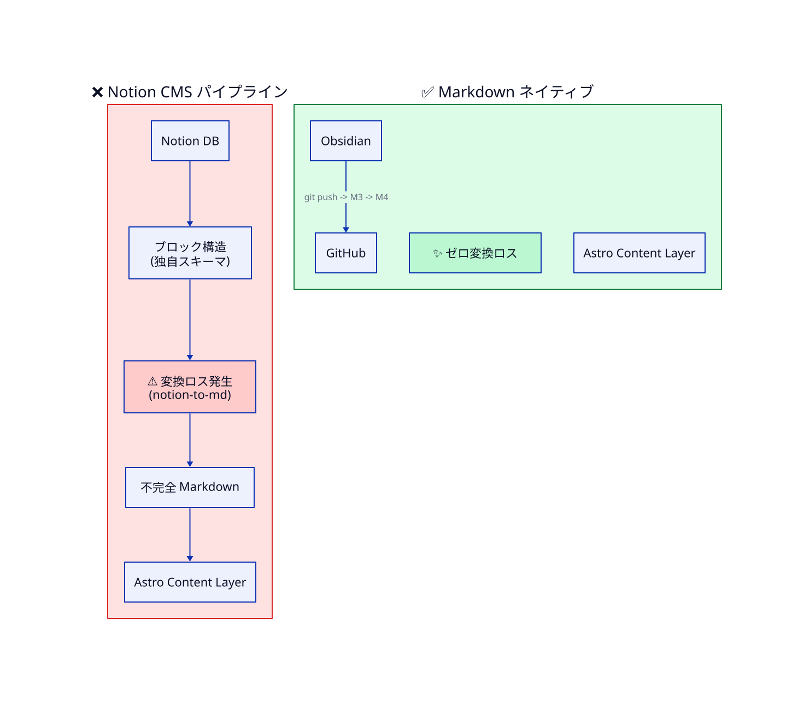

> **TL;DR**
>
> Notion を CMS にすると一見便利そうだが、Astro Content Layer は **Markdown ネイティブ** に設計されている。
> Notion 経由は変換ロス・API レート制限・型不整合・画像 URL 期限切れなど、保守性を悪化させる **技術負債** を増やす。
> Astro + Obsidian の組合せが「ゼロ変換コストパイプライン」として本質的に強い理由を解説する。

## なぜこの記事？

「ブログを Astro で作るなら、CMS は Notion にしたほうが便利では？」
モバイルから書けるし、UI も直感的で、Notion AI まで使える。複数人で書きたい時にも便利そう。

…と思った。実は私もそう思った瞬間があった。

しかし Astro Content Layer の仕組みを理解した瞬間、その選択が**「便利に見えて実は技術負債を増やす」**典型例だと気付いた。本記事はその技術的根拠を整理する。

## Astro Content Layer は何をやっているのか

Astro v5 で導入された Content Layer は、ブログ運用の心臓部だ。



ポイントは **「ビルド時に確定的に変換される」** こと。

- 入力（Markdown）と出力（HTML）が **1:1 対応**
- 変換は **テスト可能・再現可能**
- frontmatter のスキーマエラーは **公開前にビルド失敗で検知**

つまり、Astro は **「Markdown を投げ込めば、最適化された HTML が出てくる箱」** として完成している。

## Notion を挟むと何が壊れるか

Notion を CMS にする場合、上記パイプラインの入口に変換ステップを挟むことになる。

```
Notion DB
   ↓ ① Notion API 取得（JSON ブロック構造）
Notion 独自のブロック構造
   ↓ ② notion-to-md 等で MD 変換 ← ⚠️ ここで損失
不完全な Markdown
   ↓ ③ Astro Content Layer に投入
HTML 出力
```

**ステップ②で必ず情報損失または独自実装が発生する**。理由はシンプルで、Notion のブロック構造は Markdown より表現力が広いから。

### 具体的な損失箇所

| Notion 機能 | Markdown 変換時の問題 |
|---|---|
| Callout（アイコン付き） | アイコン・色情報が消える |
| Toggle（折りたたみ） | `<details>` HTML 化が必要・互換性問題 |
| Synced Block | 同期機能が完全消失 |
| Database View | Markdown に存在しない概念・別実装必要 |
| 数式 | Notion 構文 → KaTeX 構文の翻訳必要 |
| 画像 | Notion CDN URL（**期限切れリスク**）→ ローカル DL 必要 |
| コードブロック | Notion 言語指定 ≠ Astro 期待のシンタックス |
| テーブル | Notion インラインテーブル ≠ Markdown テーブル |
| メンション・リレーション | Markdown に存在しない概念・URL に変換 or 削除 |

これらを「完璧に変換するライブラリ」は存在しない。`notion-to-md` 等のオープンソースは良い線まで行くが、独自記法には個別対応が必要だ。

### 型安全性も二重管理になる

| 観点 | Astro Markdown 直接 | Notion 経由 |
|---|---|---|
| frontmatter 型検証 | ✅ z.object() で確実 | ❌ Notion プロパティ ↔ Astro 型のマッピング自作 |
| ビルド時エラー検知 | ✅ 即時 | ❌ Notion 側の変更を追従できないと runtime バグ |
| TypeScript 補完 | ✅ 効く | ❌ 効かない or 自前型生成パイプライン必要 |

Astro が提供する型安全性のメリットを **自ら手放す**ことになる。

### さらに運用上の現実問題

- **API レート制限**: 大量ビルド時に Notion API のレート制限に詰まる
- **画像 URL 期限切れ**: Notion CDN URL は時限式。ビルド時 DL 処理を自前実装
- **Notion 障害時に公開停止**: ビルドができなくなる
- **情報資産が EFFECT のローカル PC から Notion クラウドに移動**: 機密管理の境界線が変わる

## Markdown ネイティブパイプラインの本質的優位性

対照的に、Astro + Obsidian の組合せはこうなる：



全工程 **Markdown で繋がっている**。変換ロスゼロ、API 依存ゼロ、型安全性フル活用。

そしてこれがさらに強いのは、**情報資産の上流まで Markdown で揃っている場合**だ。

```
LLM Wiki（Obsidian/Markdown）
  └─ クライアント案件知見・concept ドキュメント・synthesis
   ↓ ※ 全部 Markdown
astro-blog スキル（情報資産 → 公開記事の変換層）
   ↓ ※ Markdown → Markdown
Fuwari（Astro Content Collections）
   ↓ ※ Markdown → HTML
公開
```

この **「同一フォーマットで貫通するパイプライン」** が、保守性と拡張性を最大化する。

知見の蓄積・記事の執筆・公開、すべてが同じ Markdown という形式で扱えるため、自動投稿パイプラインも自然に組める。

## まとめ：CMS 選定の判断基準

Astro でブログを作るなら、次の問いを優先するべきだ。

1. **情報資産（知見・素材）はどの形式で蓄積されているか？**
2. **Astro Content Layer の型安全性をフル活用したいか？**
3. **公開停止リスクをどう許容するか？**
4. **保守コスト（バグ修正・API 追従・スキーマ変更）を払い続けられるか？**

これらを冷静に問うと、多くの個人/小規模ブログでは **Markdown ネイティブ運用が答え** になる。Notion の便利さは魅力だが、Astro と組み合わせる時には **変換ロスのコスト**を直視すべきだ。

「便利そう」の裏で増える技術負債を可視化することが、CMS 選定の本質である。

## 関連リンク

- [Astro Content Collections（公式ガイド）](https://docs.astro.build/en/guides/content-collections/)
- [Astro Content Layer API](https://docs.astro.build/en/guides/content-collections/#defining-a-loader)
- [notion-to-md（OSS の Notion → Markdown 変換）](https://github.com/souvikinator/notion-to-md)
- [Fuwari テーマ（本ブログで採用）](https://github.com/saicaca/fuwari)
